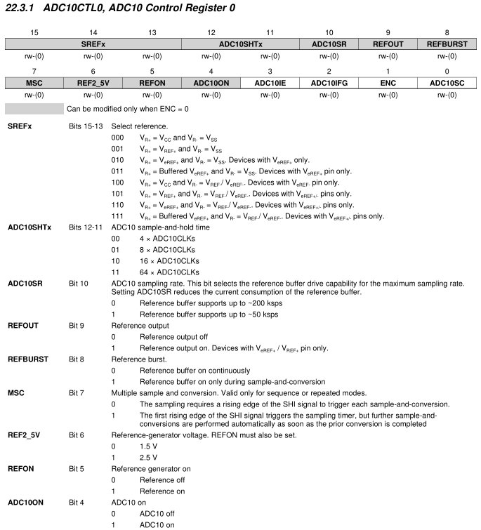
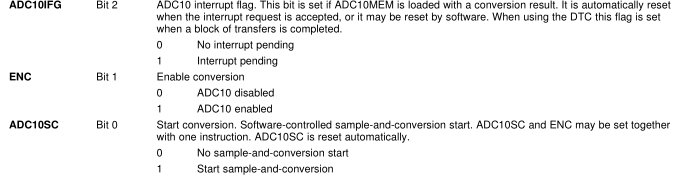
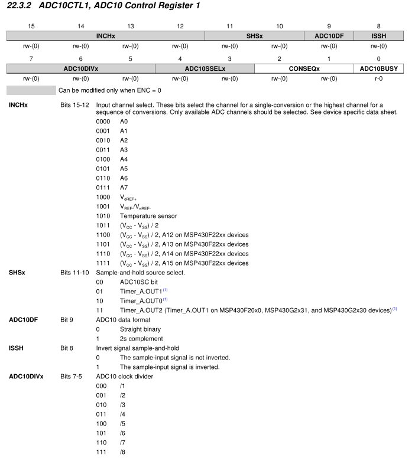
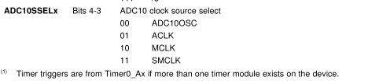
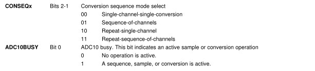
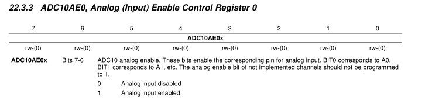
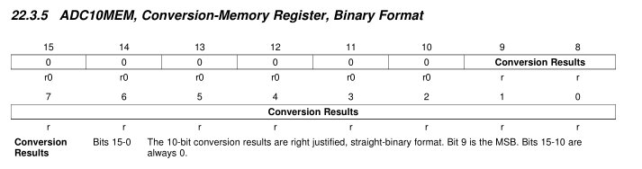

title = 'Final Resources'

# Final Resources

This, along with the GR1 and GR2 resources, will be available for you to reference during the final exam.

## Timer_A

### TACCR

### TACCTL

### Output Modes

#### Output Modes Example

## ADC10

### ADC10CTL0

### ADC10CTL1

### ADC10AE0

### ADC10MEM

