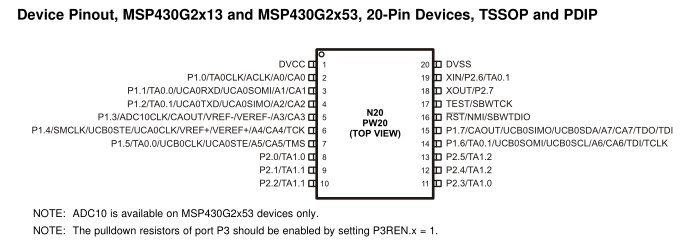
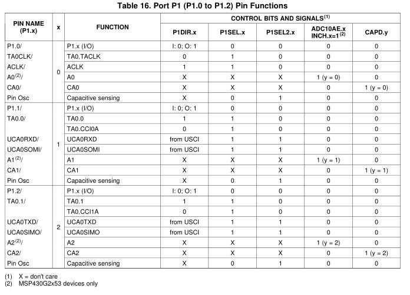
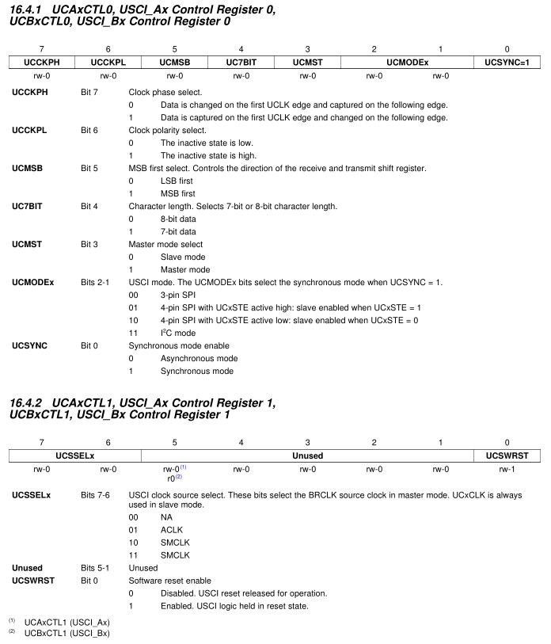
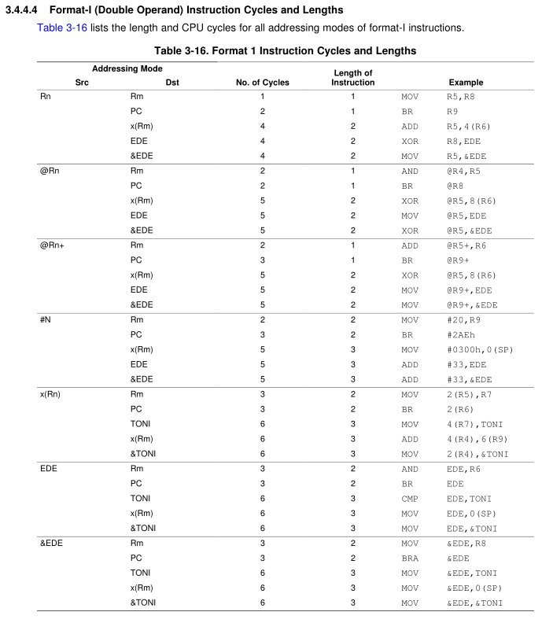
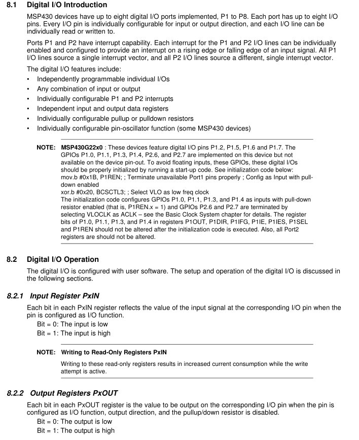
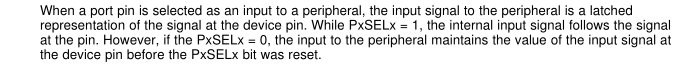

title = 'GR1 Resources'

# GR Resources

## Instruction Set

| Opcode | Assembly Instruction | Description |
| :---: | :---: | :---: |
| 000 | RRC(.B) |  9-bit rotate right through carry. C->msbit->...->lsbit->C. Clear the carry bit beforehand to do a logical right shift. |
| 001 | SWPB | Swap 8-bit register halves.  No byte form. |
| 010 | RRA(.B) | Badly named, this is an arithmetic right shift - meaning the most significant bit is preserved. |
| 011 | SXT | Sign extend 8 bits to 16.  No byte form. |
| 100 | PUSH(.B) |  Push operand on stack. Push byte decrements SP by 2. Most significant byte not overwritten.  CPU BUG: PUSH #4 and PUSH #8 do not work when the short encoding using @r2 and @r2+ is used. The workaround, to use a 16-bit immediate, is trivial, so TI do not plan to fix this bug. |
| 101 | CALL |  Fetch operand, push PC, then assign operand value to PC. Note the immediate form is the most commonly used. There is no easy way to perform a PC-relative call; the PC-relative addressing mode fetches a word and uses it as an absolute address. This has no byte form. |
| 110 | RETI | Pop SP, then pop PC. Note that because flags like CPUOFF are in the stored status register, the CPU will normally return to the low-power mode it was previously in. This can be changed by adjusting the SR value stored on the stack before invoking RETI (see below). The operand field is unused. |
| 111 | Unused | |

| Condition Code | Assembly Instruction | Description |
| :---: | :---: | :---: |
| 000 | JNE/JNZ | Jump if Z==0 (if `!=`) |
| 001 | JEQ/Z | Jump if Z==1 (if `==`) |
| 010 | JNC/JLO | Jump if C==0 (if unsigned `<`) |
| 011 | JC/JHS | Jump if C==1 (if unsigned `>`) |
| 100 | JN | Jump if N==1 - Note there is no jump if N==0 |
| 101 | JGE | Jump if N==V (if signed `>=`) |
| 110 | JL | Jump if N!=V (if signed `<`) |
| 111 | JMP | Jump unconditionally |

| Opcode | Assembly Instruction | Description | Notes |
| :---: | :---: | :---: | :---: |
| 0100 | MOV src, dest | dest = src | The status flags are NOT set. |
| 0101 | ADD src, dest | dest += src | |
| 0110 | ADDC src, dest | dest += src + C | |
| 0111 | SUBC src, dest | dest += ~src + C | |
| 1000 | SUB src, dest | dest -= src | Implemented as dest += ~src + 1 |
| 1001 | CMP src, dest | dest - src | Sets status only; the destination is not written. |
| 1010 | DADD src, dest | dest += src + C, BCD (Binary Coded Decimal) | |
| 1011 | BIT src, dest | dest & src | Sets status only; the destination is not written. |
| 1100 | BIC src, dest | dest &= ~src | The status flags are NOT set. |
| 1101 | BIS src, dest | dest &#124;=src | The status flags are NOT set. |
| 1110 | XOR src, dest | dest ^= src | |
| 1111 | AND src, dest | dest &= src | |

| Emulated Instruction | Assembly Instruction |
| :---: | :---: |
| NOP | MOV r3, r3 |
| POP dst | MOV @SP+, dst |
| BR dst | MOV dst, PC |
| RET | MOV @SP+, PC |
| CLRC | BIC #1, SR |
| SETC | BIS #1, SR |
| CLRZ | BIC #2, SR |
| SETZ | BIS #2, SR |
| CLRN | BIC #4, SR |
| SETN | BIS #4, SR |
| DINT | BIC #8, SR |
| EINT | BIS #8, SR |
| RLA(.B) | ADD(.B) dst, dst |
| RLC(.B) | ADDC(.B) dst, dst |
| INV(.B) dst | XOR(.B) #-1, dst |
| CLR(.B) dst | MOV(.B) #0, dst |
| TST(.B) dst | CMP(.B) #0, dst |
| DEC(.B) dst | SUB(.B) #1, dst |
| DECD(.B) dst | SUB(.B) #2, dst |
| INC(.B) dst | ADD(.B) #1, dst |
| INCD(.B) dst | ADD(.B) #2, dst |
| ADC(.B) dst | ADDC(.B) #0, dst |
| DADC(.B) dst | DADD(.B) #0, dst |
| SBC(.B) dst | SUBC(.B) #0, dst |

## Assembly-to-Machine Code

| 15 | 14 | 13 | 12 | 11 | 10 | 9 | 8 | 7 | 6 | 5 | 4 | 3 | 2 | 1 | 0 |
| :-: | :-: | :-: | :-: | :-: | :-: | :-: | :-: | :-: | :-: | :-: | :-: | :-: | :-: | :-: | :-: |
| 0 | 0 | 0 | 1 | 0 | 0 | Opcode colspan=3 | W=0/B=1 | Ad colspan=2 | Dest reg colspan=4 |
| 0 | 0 | 1 | Condition colspan=3 | PC offset (10 bit) colspan=10 |
| Opcode colspan=4 | Source reg colspan=4 | Ad | W=0/B=1 | As colspan=2 | Dest reg colspan=4 |

| Code | Addressing Mode | Description |
| :-: | :-: | :-: |
| 00 | Rn	| Register direct |
| 01 | offset(Rn)	| Register indexed |
| 10 | @Rn	| Register indirect |
| 11 | @Rn+	| Register indirect with post-increment |

| Code | Register | Addressing Mode | Description |
| :-: | :-: | :-: |
| 00 | 0010 | r2 | Normal access |
| 01 | 0010 | &< location> | Absolute addressing. The extension word is used as the address directly. The leading & is TI's way of indicating that the usual PC-relative addressing should not be used. |
| 10 | 0010 | #4 | This encoding specifies the immediate constant 4. |
| 11 | 0010 | #8 | This encoding specifies the immediate constant 8. |
| 00 | 0011 | #0 | This encoding specifies the immediate constant 0.  Also normal access. |
| 01 | 0011 | #1 | This encoding specifies the immediate constant 1. |
| 10 | 0011 | #2 | This encoding specifies the immediate constant 2. |
| 11 | 0011 | #-1 | This specifies the all-bits-set constant, -1. |

## MSP430G2553

## Serial Peripheral Interface (SPI)

## Instruction Lengths

## Digital IO (GPIO)

