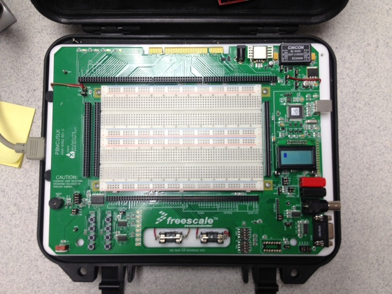
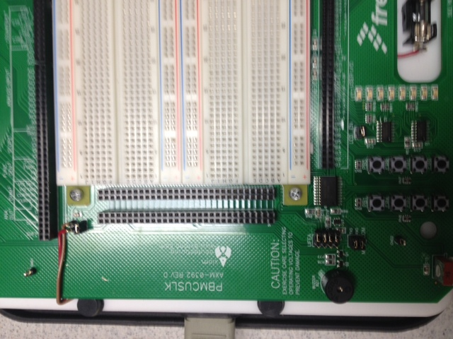

title = 'The Geek Box'

# The Geek Box

- [Geek Box Datasheet](PBMCUSLKUG.pdf)

## Intro

The Geek Box was built to interface with the chip this class used to use (68HC12 / 68S12), not the MSP430.  But we still need the buttons, LEDs, LCD, and buzzer included in the Geek Box for our labs - so we're still using it.  Since it wasn't designed for the MSP430, it isn't a totally natural fit - but we're hackers, so we'll find a way to make it work.

On the far left of the board (part farthest away from the LCD), there are two parallel banks of ports - labeled J5 and J6.  We reference them by number - 1 through 60 - odd pins on the left (1, 3, 5, 7, 9, etc.), even pins on the right (2, 4, 6, 8, etc.).  They are numbered in intervals of 10 on the box.  The old chip plugged into them perfectly.

These pins are conveniently wired through the board to different peripherals we may want to use.

- **ENSURE YOUR MSP430 AND GEEKBOX SHARE A COMMON GROUND**
    - If you neglect this, peripherals will be unpredictable
    - This is very difficult to debug

## Interfacing with the LCD

Geek box wiring details:

- Ensure the jumpers for MOSI, MISO, and CLK are connected (near the LCD on your Geek Box)
- Ensure the jumper is connected from SS to the center pin (NOT GPIO)

- Connect the signals from your Launchpad to the Geek Box
    - MOSI to Pin 17
    - MISO to Pin 19
    - CLK to Pin 21
    - SS to Pin 23

- Above image also shows common ground (rightmost wire)
- Above image also connects 5V from Geek Box to board
    - This is to run MSP430 without power from the USB
    - If you hook this up while your USB cable is connected, you could have problems
