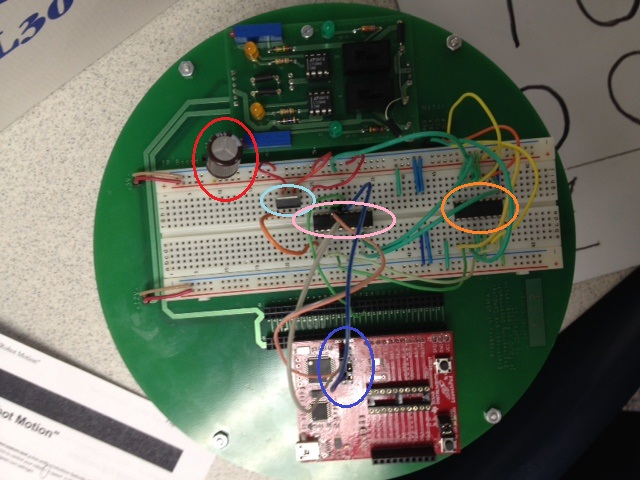

title = 'Using the MSP430 with the Robot'

# Using the MSP430 with the Robot

## Powering the MSP430

Your MSP430 cannot take the 5V available on the robot or it will burn out!  You have to use a part called a **regulator** that will take 5V in and output 3.3V.  Mr. Evans has LDV33 regulators available - [see the datasheets page](/datasheets) for more information.

## Programming the MSP430 In-Circuit

See [Programming the MSP430 In-Circuit](in_circuit_programming.html).

## How It All Looks

**Red Circle** - decoupling capacitor placed across the 5V rail to prevent current fluctuation that may cause your MSP430 to reset.

**Light Blue Circle** - regulator that converts 5V to 3.3V to power your MSP430.  Hooking 5V directly up to your MSP430 would burn it!  See datasheet for more info.

**Pink Circle** - An MSP430!  For this lab, it might be beneficial to place your MSP430 chip in the breadboard and use the Launchpad as an in-circuit programmer (see tutorial).

**Purple Circle** - Wiring the programming pins form the Launchpad board to the appropriate pins on the MSP430 (see tutorial).  Note how there is no chip in the Launchpad - I'm placing it in the port on the robot purely as a holder.

**Orange Circle** - The motor driver chip!  This allows your MSP430 to control the motors without burning up due to the current requirements.  See datasheet for more info.
