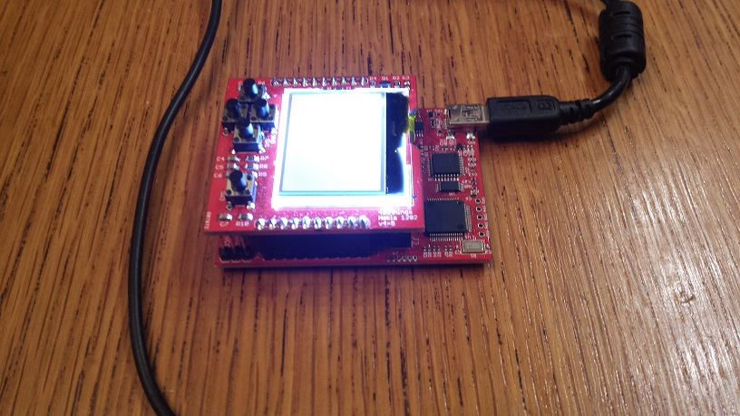
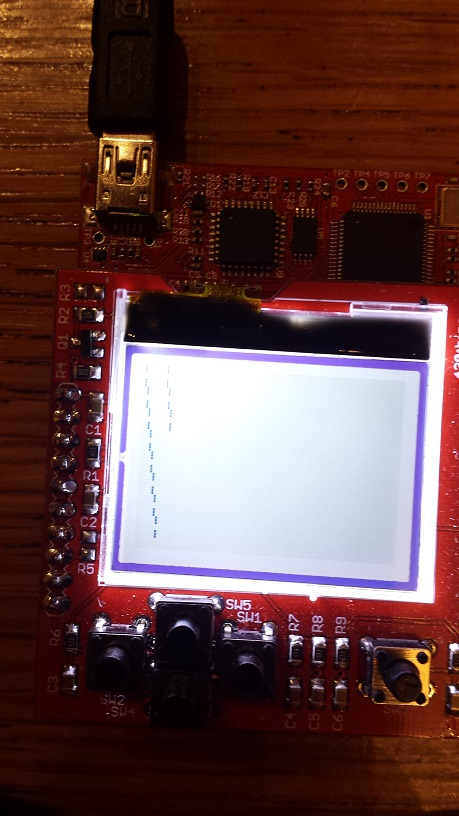
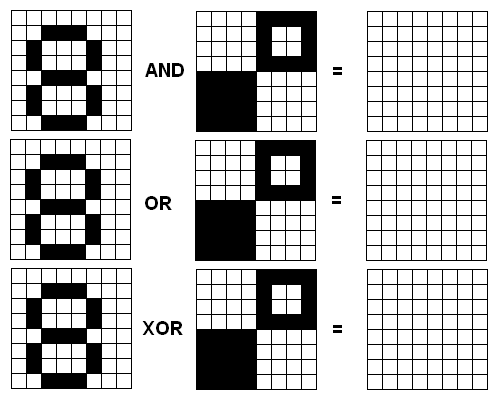

title = 'Lab 3 - SPI - "I/O"'

# Lab 3 - SPI - "I/O"

##  Mega Prelab
A hard copy of this Mega Prelab is required to be turned in.  Answers should not be handwritten.  The timing diagram may be NEATLY drawn by hand with the assistance of a straightedge on engineering paper.
### Nokia1202  LCD BoosterPack v4-5
Look at the schematic for the Nokia1202 LCD BoosterPack. Complete the following table.  The pin number should be the pin number that signal connects to on the MSP 430.  You may need to examine page 3 of the MSP430 Data Sheet. The type is from the perspective of the MSP430 and is one of the following: input, output, or power .  For example, the RST' line should  be listed as having an output type because it is an output from the  MSP430 (to an input on the Nokia 1202).  For input and output types (do nothing further with power), list their bit settings in the three registers listed (see pages 328 and 329 of the MSP430g2553 User's Guide). <br>

| Name | Pin # | Type | PxDIR| PxREN | PxOUT |
|:-: | :-: | :-: | :-: | :-: | :-: |
|GND | | | | |  |
| RST |   |   |   |   |   |
| P1.4 |   |   |   |   |   |   
| MOSI|  |   |   |   |   |   
| SCLK |   |   |   |   |   |   
| VCC |   |   |   |   |   |  
| S1 |   |   |   |   |   | 
| S2 |   |   |   |   |   | 
| S3 |   |   |   |   |   | 
| S4 || | | | | 


### Configure the MSP430
The following is a portion of the code that initalizes the directions of the pins connecting the MSP430 to the Nokia 1202 display. Use the information from the previous question to identify the names of the registers missing in the following code (identified by the letters A - D).  Put the register names in the table below.

```
mov.b	#LCD1202_CS_PIN|LCD1202_BACKLIGHT_PIN|LCD1202_SCLK_PIN|LCD1202_MOSI_PIN, & A
mov.b	#LCD1202_CS_PIN|LCD1202_BACKLIGHT_PIN|LCD1202_SCLK_PIN|LCD1202_MOSI_PIN, & B
mov.b	#LCD1202_RESET_PIN, & C
mov.b	#LCD1202_RESET_PIN, & D
```
| Mystery Label | Register|
|:-: |:-: |
| A|  |
| B |  |
| C |  |
| D |  |


The following initializes the SPI subsystem of the MSP430.  For each of the bits listed in the table below, identify how the code-snippet configures that pin and what function is realized by that setting.  For example, setting the UCMSB bit of the UCB0CTL0 register forces the SPI subsystem to output the bits starting from the LSB.  Also, list the bit position that each occupies in its associated register.
```
	bis.b	#UCCKPH|UCMSB|UCMST|UCSYNC, &UCB0CTL0
	bis.b	#UCSSEL_2, &UCB0CTL1
	bic.b	#UCSWRST, &UCB0CTL1
```

| ID | Bit | Function as set in the code |
|:-:|:-:|:-:|
| UCCKPH | | |
| UCMSB | | |
| UCMST | | |
| UCSYNCH| | |
| UCSSEL_2|  | |
| UCSWRST| | |

### Communicate to the Nokia1202 display
The following code communicates one byte to the Nokia 1202 display using its 9-bit protocol.  Use this code to draw a timing diagram of the expected behavior of LCD1202_CS_PIN, LCD1202_SCLK_PIN, LCD1202_MOSI_PINs from the begining of this subroutine to the end.  Make sure that you clearly show the relationship of the edges in the clk and data waveforms.
```
;-------------------------------------------------------------------------------
;	Name:		writeNokiaByte
;	Inputs:		R12 selects between (1) Data or (0) Command string
;				R13 the data or command byte
;	Outputs:	none
;	Purpose:	Write a command or data byte to the display using 9-bit format
;-------------------------------------------------------------------------------
writeNokiaByte:

	push	R12
	push	R13

	bic.b	#LCD1202_CS_PIN, &P1OUT				; LCD1202_SELECT
	bic.b	#LCD1202_SCLK_PIN | LCD1202_MOSI_PIN, &P1SEL	; Enable I/O function by clearing
	bic.b	#LCD1202_SCLK_PIN | LCD1202_MOSI_PIN, &P1SEL2	; LCD1202_DISABLE_HARDWARE_SPI

	bit.b	#01h, R12
	jeq	cmd

	bis.b	#LCD1202_MOSI_PIN, &P1OUT			; LCD1202_MOSI_LO
	jmp	clock

cmd:
	bic.b	#LCD1202_MOSI_PIN, &P1OUT			; LCD1202_MOSI_HIGH

clock:
	bis.b	#LCD1202_SCLK_PIN, &P1OUT			; LCD1202_CLOCK positive edge
	nop
	bic.b	#LCD1202_SCLK_PIN, &P1OUT			; negative edge

	bis.b	#LCD1202_SCLK_PIN | LCD1202_MOSI_PIN, &P1SEL	; LCD1202_ENABLE_HARDWARE_SPI;
	bis.b	#LCD1202_SCLK_PIN | LCD1202_MOSI_PIN, &P1SEL2	;

	mov.b	R13, UCB0TXBUF

pollSPI:
	bit.b	#UCBUSY, &UCB0STAT
	jz		pollSPI					; while (UCB0STAT & UCBUSY);

	bis.b	#LCD1202_CS_PIN, &P1OUT				; LCD1202_DESELECT

	pop		R13
	pop		R12

	ret
```
### Configure the Nokia1202 display
The following code configures the Nokia 1202 display to display pixels.  The code consists of two main areas.  The first section holds the reset line low and then high for a specific length of time.  You will measure the duration of the reset pulse later in the lab. <br> <br>
The second section sends a sequence of commands to the Nokia 1202 display.  Your task is to use the the information on page 42 (and beyond) of the STE2007 technical document to decode the symbolic constants moved into register R13 on the lines marked with "DECODE HERE".

```
;-------------------------------------------------------------------------------
;	Name:		initNokia		68(rows)x92(columns)
;	Inputs:		none
;	Outputs:	none
;	Purpose:	Reset and initialize the Nokia Display
;-------------------------------------------------------------------------------
initNokia:

	push	R12
	push	R13

	bis.b	#LCD1202_CS_PIN, &P1OUT

	;-------------------------------------------------------------------------------
	; Measure the time that the RESET_PIN is held low by the delayNokiaResetLow loop
	bic.b	#LCD1202_RESET_PIN, &P2OUT
	mov	#0FFFFh, R12
delayNokiaResetLow:
	dec	R12
	jne	delayNokiaResetLow
	bis.b	#LCD1202_RESET_PIN, &P2OUT
	;-------------------------------------------------------------------------------

	mov	#0FFFFh, R12
delayNokiaResetHigh:
	dec	R12
	jne	delayNokiaResetHigh
	bic.b	#LCD1202_CS_PIN, &P1OUT

	; First write seems to come out a bit garbled - not sure cause
	; but it can't hurt to write a reset command twice
	mov	#NOKIA_CMD, R12
	mov	#STE2007_RESET, R13					; DECODE HERE
	call	#writeNokiaByte


	mov	#NOKIA_CMD, R12
	mov	#STE2007_RESET, R13
	call	#writeNokiaByte

	mov	#NOKIA_CMD, R12
	mov	#STE2007_DISPLAYALLPOINTSOFF, R13			; DECODE HERE
	call	#writeNokiaByte

	mov	#NOKIA_CMD, R12
	mov	#STE2007_POWERCONTROL | STE2007_POWERCTRL_ALL_ON, R13	; DECODE HERE
	call	#writeNokiaByte

	mov	#NOKIA_CMD, R12
	mov	#STE2007_DISPLAYNORMAL, R13				; DECODE HERE
	call	#writeNokiaByte

	mov	#NOKIA_CMD, R12
	mov	#STE2007_DISPLAYON, R13					; DECODE HERE
	call	#writeNokiaByte

	pop	R13
	pop	R12

	ret
```
Complete the table below.  To answer this question you will have to use some common sense in decoding the meaning of the symbolic constants.


| Symbolic Constant | Hex | Function |
| :-: | :-: | :-: |
|#STE2007_RESET| | |
|#STE2007_DISPLAYALLPOINTSOFF| | |
|#STE2007_POWERCONTROL| | | 
|#STE2007_POWERCTRL_ALL_ON | | |
|#STE2007_DISPLAYNORMAL | | |
|#STE2007_DISPLAYON | | |

(This marks the end of the Mega Prelab.)
---------------------------------------------------------------
## Logic Analyzer
###Physical communication
Connect the Nokia 1202 Booster Pack to your TI Launch Pad.  Make sure that the buttons on the Booster Pack are pointed away from the USB connector (and on the same side of the board as the MSP430 buttons), just like in the following picture.
<br>
Download <a href="lab3.asm">lab3.asm</a> and build a project around the file.
Run the program and observe the output on the LCD every time you press the SW3 button.  It should look something like the following image after a few button presses.<br>
<br>
Now connect wires to GND, SCLK, MOSI, and RESET.  Use the pin numbers from the prelab to determine which pins to use.  Connect the Logic Analyzer to these lines and capture the following information:

- Setup the Logic Analyzer to capture the RESET signal on a falling edge.  Measure the duration that the RESET line is held low in the initNokia subroutine.
- Setup the logic analyzer to capture the waveform generated when the SW3 button is pressed.  Identify the calls to writeNokiaByte in the lab3.asm program that generated the 4 packets.
- Setup the logic analyzer to capture the waveform generated when the SW3 button is pressed.  Decode the contents of the 4 packets and explain how their concents correpond to what was drawn on the display.  Be specific with the relationship between the data values and what and where the pixels are drawn.
- What is the frequency of the SCLK waveform when sending the final 8 bits?
(Under construction)


###Writing modes
The native write operation to the Nokia 1202 will overwrite any information that is was on the display with new information.  However, that may not be the best course of action in your application.  The new bits being added to the image may be merged using the AND, OR, XOR operators.  To do this treat a black pixel as a logic 1 and a white pixel as a logic 0.  The pixel values from the same locations are combined using a logical operator and placed at the corresponding location in the destination imaged.
Import the following image into a paint program and show the result of the operation between the two bits maps combined using the logic operator specified.

## Functionality
(Under construction)

## Grading

| Item | Grade | Points | Out of | Date | Due |
|:-: | :-: | :-: | :-: | :-: |
| Mega Prelab | **On-Time** -------------------------------------------------------------------- **Late:** 1Day ---- 2Days | | 20 | | EOC L16 |
| Required Logic Analyzer | **On-Time** -------------------------------------------------------------------- **Late:** 1Day ---- 2Days ---- 3Days ---- 4+Days| | 35 | | COB L17 |
| Required Functionality | **On-Time** -------------------------------------------------------------------- **Late:** 1Day ---- 2Days ---- 3Days ---- 4+Days| | 15 | | COB L19 |
| A Functionality | **On-Time** -------------------------------------------------------------------- **Late:** 1Day ---- 2Days ---- 3Days ---- 4+Days| | 10 | | COB L19 |
| Lab Notebook | **On-Time** -------------------------------------------------------------------- **Late:** 1Day ---- 2Days ---- 3Days ---- 4+Days| | 20 | | COB L20 |
| **Total** | | | **100** | | ||

