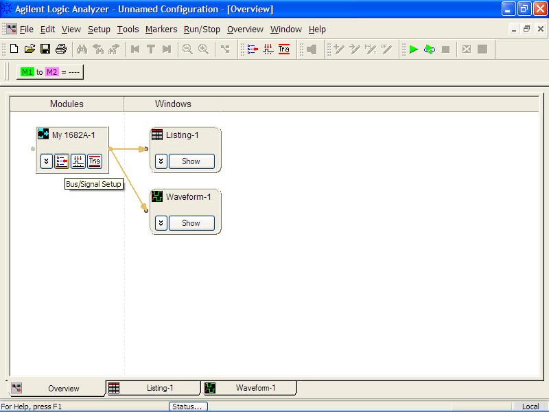
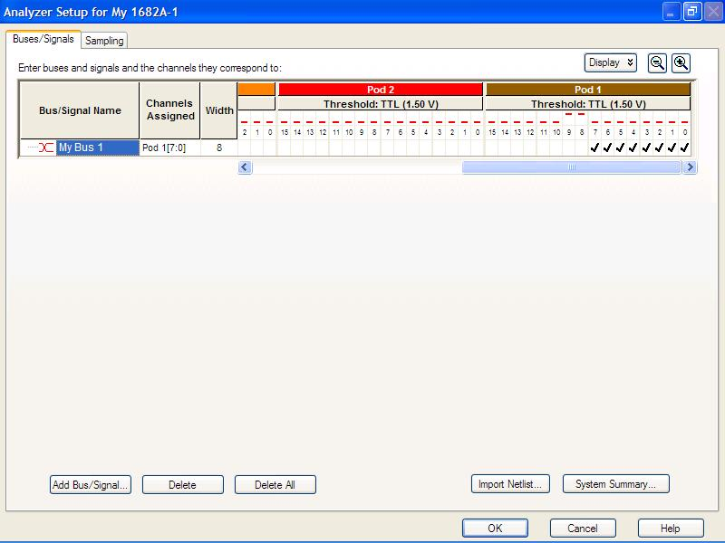
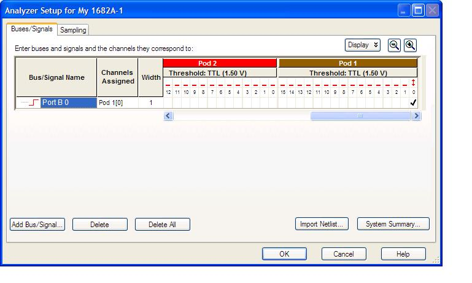
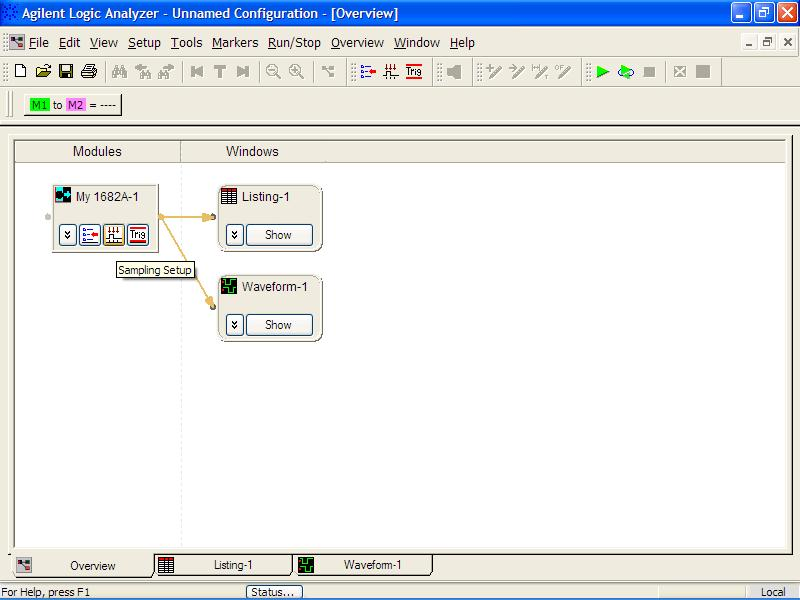
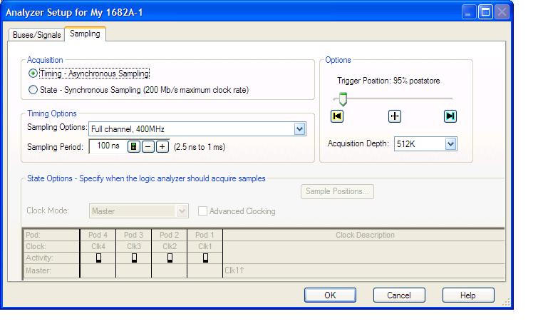
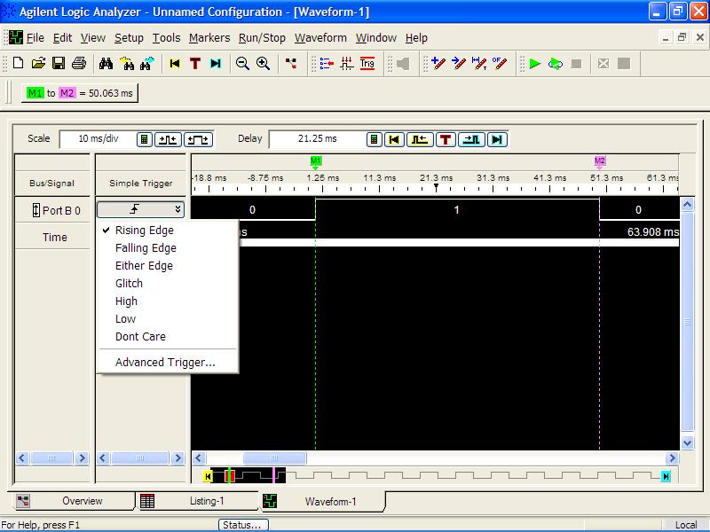
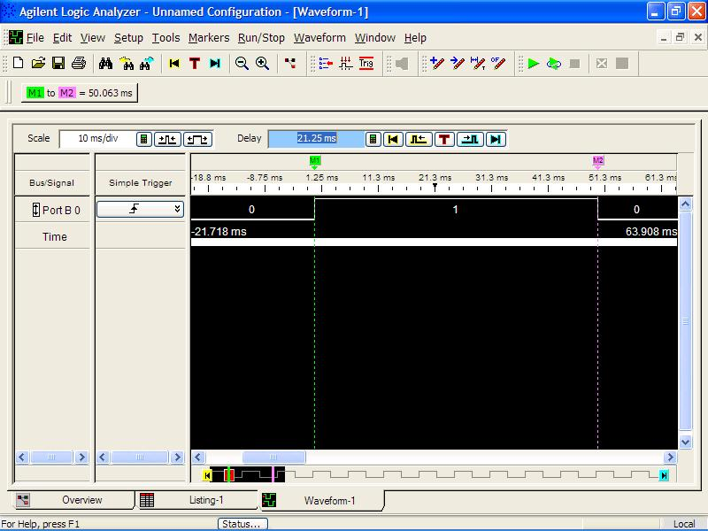

# The Logic Analyzer

You have used oscilloscopes previously to display 1 to 4 analog signals.  A logic analyzer is similar, but instead displays up to 64 digital signals.  The logic analyzer works by waiting for a "trigger" (a unique user specified signal) to occur, then samples the various signals (at a user specified sample rate) and stores all the samples in memory until the memory is full.

Our Agilent 1682A logic analyzers are actually PCs running windows.  You can interface with the logic analyzers using a standard mouse and keyboard, or the knobs and buttons on the face of the display.

Here's a quick runthrough on how to use it to measure the characteristics of a signal.

1. Turn the logic analyzer's power on.
2. Login as engineer in training by double clicking on the icon.
3. Connect the probes in Pod 1 (which contains 16 data probes) to the following pins:
    - Probe 0 to the signal you want to measure
    - Ground to ground
4. The logic analyzer should come up in the overview window. (If in the waveform window, click on the overview tab).
  
5. In the My 1682A-1 block, click on bus/signal setup icon.
  
6. You will see activity arrows on Probe 0.  Similar to logic probes, the red bars represent if the lines are high, low, or changing (up/down arrow).  In the previous figure,  Pins 8 and 9 are High, while all the other pins are low.
7. In the My 1682A-1 block, click on bus/signal setup icon.  Under bus/signals, you allocate a probe (or multiple probes) to a label.  When you first come into the screen, you should find only one active label (my bus1) which is configured for both Pod 1 pins 0 to 7.  Ensure Pod 1 pins 0 is assigned to this label (a check means the pin is assigned to this label) and uncheck the others. You can also rename the label to something like "PORT1.3".
8. Click OK and return to the overview window.  
  
  
9. In the my 1682-A-1 block, select the sampling setup box.  This allows you to define how the signal should be sampled.  Ensure that acquisition is set to timing; sampling options is set to full channel, 500 MHz; sampling period is set to something appropriate for the signal you're sampling; and acquisition depth is 4M.  Acquisition depth is the amount of samples stored in memory each time.  The trigger position slider selects the relative position of the trigger event relative to the data stored in the acquisition buffer.  The default should be in the middle (50%).  I usually prefer to see more of the data after the trigger event, than before the trigger event, so I slide the selector over to around 95% poststore.  What is a trigger event?  See the next section.  Click OK.  

The acquisition mode determines if the logic analyzer uses an internal clock, or requires an external clock.  

The sampling period determines how often the logic analyzer takes a sample on the channels. A higher sampling rate provides a higher fidelity measurement, but fills the memory quicker, so the measurements are taken over a shorter interval. You have to decide the proper trade-off when setting this value. How much precision do you need versus how long do you have to measure the signal?  
  
10. Click on waveform-1 block (shown).  We can set simple triggers in this window.  I double click to the right of the Port B 0 label in the "simple trigger" column and change this to "rising edge", as shown below. The logic analyzer has much more powerful trigger options available, but they are not needed for this lab.  
  
11. Have the logic analyzer perform a measurement by pushing the Run Single button on the right side of the machine.  A display will appear showing the signal measured.  The white tick marks along the time row correspond to the exact time the samples were taken.  
  
12. How do I zoom in/out and measure timing?
    a. Find the zoom in/out buttons in the window.  Click on these and notice the zoom in time changes.  Scale tells you the time/div for the zoom.  You can also use the Horizontal knob to adjust the zoom. Finally, you can also zoom in with the mouse, by dragging an area to zoom.  Try these out.
    b. The Delay knob (and setting in the window) allows you to scroll left/right through the waveform relative to the triggering event.  Try the delay knob.  Return the Delay to 0 which places the trigger in the center of the screen.  You can also manually enter a time, such as 0 sec, instead of turning the knob.
    c. You can also measure time differences using markers.  You can use the mouse to move the green (M1) and purple (M2) markers and see what they measure.  Or you can use the marker knob and choose button to control the markers.

**How do I save these image to paste in my lab book?**

1. If you print directly from the waveform screen, you will print out your equipment settings or any marker measurements you make. Here is the simple way to print everything of interest:   While the image is on the screen, press the Print Screen button on the keyboard, which captures the screen and puts it on the “clipboard”.  Open up the Microsoft paint program (remember this is just a PC) and edit à paste.  Before you print from Microsoft Paint, go into page setup and change the page scaling so the printout is scaled to only one page. 

2. The logic analyzers are NOT hooked up to the internet (to avoid the comm. squadron putting all their bloat-ware on our nice clean logic analyzers).

DO NOT REMOVE the yellow cables with red boots from the logic analyzers.
