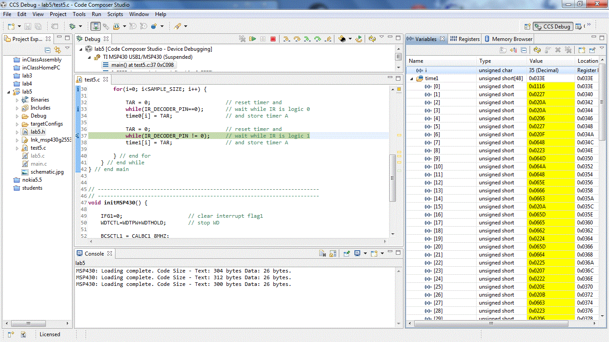
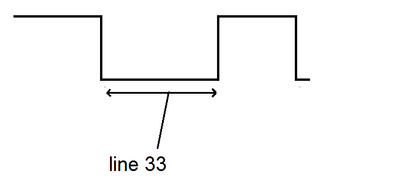

title = 'Lab 5 - Interrupts - "Remote Control Decoding"'

# Lab 5 - Interrupts - "Remote Control Decoding"

## Objectives

In this lab, you'll use your knowledge of interrupts and the Timer_A subsytem to reverse engineer a remote control.  

## Details

### The Basic Idea

You will need to use the timer interrupt and the general purpose pin interrupt to decode a remote control.  Be sure to pick one remote for the whole lab, as remote codes vary.  

Lab day 1: learn the timing and bit patterns for your remote control
 
Lab day 2: demonstrate your code can receive and decode button presses from the remote control

Lab day 3: implement etch-a-sketch or pong

### Lab day 1

Answers to these activities should be posted to GitHub.

#### Timer Counts
Build a project around test5.c and then download it onto your LaunchPad. Make sure to open the variables tab (View -> Variables). I also like to clear memory from the Memory Browser tab (View -> Memory Browser), Fill Memory from 0x200 to 0x400 with 0's. Run the program and then press a button on a remote. Then pause the program and look at the variables. You should see something like the following.  

 

A few questions about what goes on in this program are in order before we proceed.
1) How long will it take the timer to roll over?
2) How long does each timer count last?

The while(1) loop in main reads in the ir pules in the for loop. 

Annotate the picture below to indicate which line of the for loop in the program is executed at which part of the pulse. You should show a total of 6 lines of code (lines 32-34 and lines 36-38).
 

 

#### IR data packets

Before you start on this portion of the assignment, watch [Dave Jones' Trigger Hold-off Tutorial](http://www.youtube.com/watch?v=ta096oBzSac). You are going to need to use the O'scopes to examine the IR waveforms generated by a remote control of your choice. 

Setup your LaunchPad like the picture below. Make sure to connect the power and ground in the correct order! Connect the the O'scope on the Vout pin of the Vishay Remote Control Decoder. 
 
![LaunchPad setup]
 

Set the trigger threshold to mid voltage and the trigger hold-off to accommodate an IR packet. On my remote control, this was about 80ms. Please note that remote control data packets are not standardized by any means, so the remote that you use to perform these experiment will almost certainly generate different results than those that your neighbor's will generate.

List the lengths of the pulses generated by the remote control in absolute time using the O'scope (3 significant figures) and in timer A counts.  Note: "start logic 0 half-pulse" refers to the logic LOW portion of the start pulse, and "data 0 logic 1 half pulse" refers to the second half (which is a logic HIGH) of the pulse representing a zero bit.

| Pulse | Duration (ms)	| Timer A counts |
| :-: | :-: | :-: |
| Start logic 0 half-pulse | | |
| Start logic 1 half-pulse | | | 	 
| Data 1 logic 0 half-pulse | | | 	 
| Data 1 logic 1 half-pulse | | |	 
| Data 0 logic 0 half-pulse | | |	 
| Data 0 logic 1 half-pulse | | |	 
| Stop logic 0 half-pulse | | | 
| Stop logic 1 half-pulse | | | |

Collect and tabulate in Excel 8 samples of timer A counts for each of the following pulse types (in decimal). Compute the average and standard deviation of each pulse type. I would suggest just grabbing it from the CCS variables tab.  
- Data 1, logic 1 half-pulse
- Data 0, logic 0 half-pulse
- Data 0, logic 1 half-pulse
 
Ensure you label the rows and columns of your table so that I will know what the information in each cell means.
For each pulse type list the range of timer A counts that would correctly classify 99.9999426697% of the pulses. This number has something to do with the [standard deviation](http://en.wikipedia.org/wiki/Standard_deviation#Rules_for_normally_distributed_data) (hint: look at the table in this section).
 
Write the codes (in hex) for several remote control buttons. 

| Button | code (not including start and stop bits) |
| :-: | :-: |
| 0 | |	 
| 1 | | 
| 2 | |	 
| 3 | | 
| Power | |	 
| VOL +	| | 
| VOL -	| | 
| CH + | |
| CH - | | |

### Required Functionality

Watch the video andachieve that functionality.  Turn an LED on and off with onebuttonon the remote.  Turn another LED on and off witha different button.

### B Functionality

### A Functionality

Use the buttons on a remote control to either control your lab #4 etch-a-sketch (up, down, right, left, color) or your pong game.

## Given code
- [test5.c](test5.c)

## Prelab

Read the assignment so you can make good use of your time in class.

## Grading

| Item | Grade | Points | Out of | Date | Due |
|:-: | :-: | :-: | :-: | :-: |
| Day 1 activities | **On-Time** ------------------------------------------------------------------ **Late:** 1Day ---- 2Days ---- 3Days ---- 4+Days| | 35 | | BOC L29 |
| Day 2 functionality | **On-Time** ------------------------------------------------------------------ **Late:** 1Day ---- 2Days ---- 3Days ---- 4+Days| | 10 | | BOC L30 |
| A Functionality | **On-Time** ------------------------------------------------------------------ **Late:** 1Day ---- 2Days ---- 3Days ---- 4+Days| | 15 | | COB L30 |
| Use of Git / Github | **On-Time:** 0 ---- Check Minus ---- Check ---- Check Plus ---- **Late:** 1Day ---- 2Days ---- 3Days ---- 4+Days| | 15 | | COB L31 |
| Code Style | **On-Time:** 0 ---- Check Minus ---- Check ---- Check Plus ---- **Late:** 1Day ---- 2Days ---- 3Days ---- 4+Days| | 15 | | COB L31 |
| README | **On-Time:** 0 ---- Check Minus ---- Check ---- Check Plus ---- **Late:** 1Day ---- 2Days ---- 3Days ---- 4+Days| | 10 | | COB L31 |
| **Total** | | | **100** | | |
|
