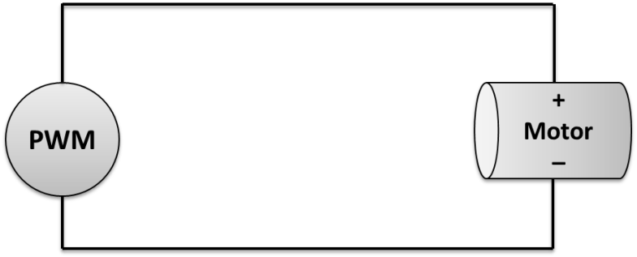

title = 'Lab 6 - PWM - "Robot Motion"'

# Lab 6 - PWM - "Robot Motion"

[Teaching Notes](notes.html)

**[A Note On Robot Sharing](other_peoples_robots.html)**

## Lab Overview

This lab is designed to provide you with experience using the pulse-width modulation features of the MSP430.  You will need to program the MSP430 to generate pulse-width-modulated waveforms to control the speed / direction of your robot's motors.  In this lab, you will make your robot move forward, backwards, a small (< 45 degree) turn left/right, and a large (> 45 dgree) turn left/right.

## Driving Motors

Our mobile robots have DC motors to drive the wheels.  The amount of torque provided by the motor is directly proportional to the amount of voltage provided.  Therefore, there are two ways of varying the speed of the DC motors:

1. Provide an analog voltage where the magnitude is proportional to the output torque desired.
2. Provide a PWM signal where the duty cycle provides an "average" voltage proportional to the output torque desired.  This is shown if Figure 1.

Figure 1: The PWM signal creates a certain duty cycle which will provide an "average" voltage to the motor.  This average voltage is proportional to the motor's output torque.

The motor can move in two directions.  If you ground one terminal of the motor and connect the PWM signal to the other side of the terminal, then the motor shaft moves in one direction.  If you swap the terminals, the motor will move in the opposite direction.

You might want to program your robot so it turns like a tank; one wheel moves forward while the other one reverses.  You will have to experiment with your robot to find out how long the PWM signal needs to be provided to turn an appropriate amount.

## Required Functionality

Demonstrate movement forward, backwards, a small (< 45 degree) turn left/right, and a large (> 45 dgree) turn left/right.  The robot should perform these movements sequentially, completely disconnected from a computer (no USB cord).

## B Functionality

Release a robot movement library on Github.  Document your interface and provide sample code using the library functions in a README.

## A Functionality

Use input capture to count PWM periods instead of `_delay_cycles()` to determine the length of your movement elements.

You can use a dedicated PWM signal for timing - this is probably the easiest approach.

## Prelab

Paste the grading section in your lab notebook as the first page of this lab.

Include whatever information from this lab you think will be useful in creating your program.

**Note that the prelab is worth 15pts on this lab - allocate your efforts accordingly!**

Consider your hardware (timer subsystems, chip pinout, etc.) and how you will use it to achieve robot control.  Which pins will output which signals you need?  Which side of the motor will you attach these signals to?  How will you use these signals to achieve forward / back / left / right movement?  **Spend some time here, as these decisions will dictate much of how difficult this lab is for you.**

Consider how you will setup the PWM subsytem to achieve this control.  What are the registers you'll need to use?  Which bits in those registers are important?  What's the initialization sequence you'll need?

Consider what additional hardware you'll need (regulator, motor driver chip, decoupling capacitor, etc.) and how you'll configure / connect it.

Consider the interface you'll want to create to your motors.  Do you want to move each motor invidiually (`moveLeftMotorForward()`)?  Or do you want to move them together (`moveRobotForward()`)?

## Notes

### Motor Control Suggestions

There are many ways to control your robot motors using the resources on the MSP430.  I'm leaving this purposesly open-ended to see the creative approaches you come up with.  Here are a few ideas to get your started:

- Output four independent PWM signals - two for each motor
  - Use RESET mode on the signals you want to ground
  - Use RESET/SET mode or TOGGLE mode on the signals you want to be PWM
    - NOTE: CCR0 cannot use RESET/SET mode because it dictates the Timer_A period
- Output three independent PWM signals - two for forward on each motor, one common for reverse
  - Forward signals would be independent - reverse would be the same
  - Limitation: you wouldn't be able to turn tank-style
- Use internal PWM to trigger interrupts, in which you use GPIO to create motor signals
  - In this approach, you'd only need two PWM signals
  - You could use global variables to control direction
  - You wouldn't have to worry about multiplexing and pin limitations on our packaging.

Or invent your own!

### Using the MSP430 and Launchpad with the Robot

[See the writeup available in the datasheets section of the site.](/datasheets/robot.html)

### Motor Driver Chip

The robot motors require ~12V and a high amount of current – both of which would immediately burn out your microcontroller if it were directly connected to the motors.  The motor driver chip (SN754410) takes a 5V input and produces a ~12V output.  Each chip has up to four channels of 5V inputs (1A, 2A, 3A, and 4A) and four corresponding 12V outputs (1Y, 2Y, 3Y, and 4Y).

Measure voltage across the 12V rail to determine what is actually being supplied by your battery.

**The motor driver chip can only supply 1A per circuit!  Do not exceed that!**

You can test your 12V PWM motor driver chip output by connecting it to the oscilloscope.  Do not use the logic analyzer for the 12V PWM signals!

### Motor Stall Current

To ensure you never exceed 1A drawn from your motor driver chip, you have to determine the worst-case current draw from your motors.  This is called the **motor stall current** and usually occurs when your robot is pushing against an object it can't move (i.e. a wall) or switching directions quickly.

To measure motor stall current, connect your robot to a power supply in series with an ammeter.  Allow the wheel to run freely and apply a voltage you expect to use.  Then, stop the wheel with your hand and monitor the current.  This is your worst-case expected current draw at that voltage.  If it exceeds 1A, you can't run your motor at that voltage or risk burning your motor driver chip on motor stall.  Reduce the voltage until the stall current is below 1A to see a safe voltage you can drive your motor at.

On my robot, the stall current does not go below one amp until my motor is being driven at 8V or less - roughly 60% duty cycle.  Exceed this at your own risk!

### Decoupling Capacitors

The robot motors have the potential to create voltage fluctuations due to sudden spikes in current draw.  They can also induce noise on the 5V line.  This can cause your microcontroller to reset.  To mitigate these fluctuations and noise, you'll need to use some capacitors:

- One large capacitor (~100uF) across the 12V rail
  - To supplement current when motor draw spikes
- One smaller capacitor (~0.1uF) across the 5V rail
  - To smooth high frequency noise
- One small capactior (10pF) between the RST pin and ground
  - To smooth noise to the RST pin
  - The RST pin is **extremely** sensitive to voltage fluctuations
  - If voltage drops, even briefly, it will reset your MCU

### How to Drive Your Motors

- You never want to send voltage to both motor terminals simultaneously.  This will create a short in your motor driver chip and cause it to burn out.
- Avoid sudden direction changes - these cause spikes in current draw by the motors.
  - I often make both motor terminals low for ~10k clock cycles before switching direction.

### Breaking Parts

You'll probably break parts on this lab - you'll know by the burning smell!

This will sometimes result in a short, causing you to burn out one of the fuses on the battery management board that protect the batteries.  When the light on the battery goes from green to yellow, that means there's something is wrong. Either the battery is dead or you've burned a fuse.

To test whether a fuse is burned, use the ohmmeter - a working fuse should have very little resistance. You should turn off the power before you do this!  You can also use a voltmeter - there shouldn't be much voltage drop across a working fuse.  If you have burned a fuse, don't just replace it and try again - try to figure out what caused the fuse to burn in the first place! If you burned your motor driver chip, replace that - but also figure out why you burned it!  If you don't fix the root cause, you'll just break more parts and cost yourself more time / frustration.

## Grading

| Item | Grade | Points | Out of | Date | Due |
|:-: | :-: | :-: | :-: | :-: |
| Prelab | **On-Time:** 0 ---- Check Minus ---- Check ---- Check Plus | | 15 | | BOC L33 |
| Required Functionality | **On-Time** ------------------------------------------------------------------ **Late:** 1Day ---- 2Days ---- 3Days ---- 4+Days| | 35 | | COB L35 |
| B Functionality | **On-Time** ------------------------------------------------------------------ **Late:** 1Day ---- 2Days ---- 3Days ---- 4+Days| | 10 | | COB L35 |
| A Functionality | **On-Time** ------------------------------------------------------------------ **Late:** 1Day ---- 2Days ---- 3Days ---- 4+Days| | 10 | | COB L35 |
| Use of Git / Github | **On-Time:** 0 ---- Check Minus ---- Check ---- Check Plus ---- **Late:** 1Day ---- 2Days ---- 3Days ---- 4+Days| | 10 | | COB L36 |
| Code Style | **On-Time:** 0 ---- Check Minus ---- Check ---- Check Plus ---- **Late:** 1Day ---- 2Days ---- 3Days ---- 4+Days| | 10 | | COB L36 |
| README | **On-Time:** 0 ---- Check Minus ---- Check ---- Check Plus ---- **Late:** 1Day ---- 2Days ---- 3Days ---- 4+Days| | 10 | | COB L36 |
| **Total** | | | **100** | | |
