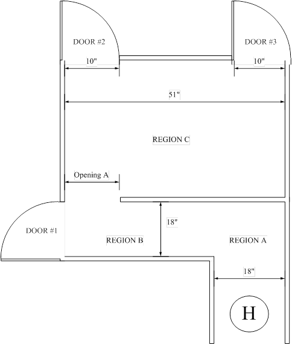

title = 'Lab 8 - Robot Maze'

# Lab 8 - Robot Maze

## Overview

During this lab, you will combine the previous laboratory assignments and program your robot to autonomously navigate through a maze.  On the last day of the lab, each section will hold a competition to see who can solve the maze the fastest.  The fastest time in ECE 383 will have their name engraved on a plaque in the CSD lab.  Believe it or not, the main goal of this lab is for you to have some fun with electrical and computer engineering!

## Requirements

You must write a program that autonomously navigates your robot through a maze (Figure 1) while meeting the following requirements:

1. Your robot must always start at the home position.
2. Your robot is considered successful only if it finds one of the three exits and moves partially out of the maze.
3. A large portion of your grade depends on which door you exit.

    a. Door 1 - 75% lab functionality

    b. Door 2 - 90% lab functionality

    c. Door 3 - 100% lab functionality

4. Your robot must solve the maze in less than three minutes.
5. Your robot will be stopped if it touches the wall more than twice.
6. Your robot must use the IR sensors to find its path through the maze.

**Do not step onto the maze since the floor will not support your weight.  You will notice the maze floor is cracked from cadets who ignored this advice.**

## Competition Requirements

All the laboratory requirements above are required to be met for the maze, with the following additional requirements:

1. Each robot will get only three official attempts to complete the maze.  The best time will be used for your score.
2. You must notify a referee/instructor before you make an official attempt.
3. Your robot must find and exit through Door 3.
4. The robot with a lowest adjusted time will be the winner.
5. Each collision with a wall will add an additional 20 seconds to your total time.

## Hints
There are a variety of techniques that cadets have used in the past to solve the maze.  Here are a few:

- Use a wall-following algorithm (i.e., it tries to maintain a certain distance from the wall).
- Use an empty-space detecting algorithm.  If it gets too close to a wall, it steers away.

- Use two PWM signals so you can “guide” the robot left or right while still moving forward.

- For speed, experiment with your trapezoidal speed profile to see what your hardware can handle.

- Two motor driver chips will increase the maximum PWM duty cycle.

**Note: Many cadets get poor grades on this lab because their lab notebook documentation is lacking.**

**Figure 1: Diagram of the maze your robot must navigate.  Your demonstration grade depends on which door you go through.**
