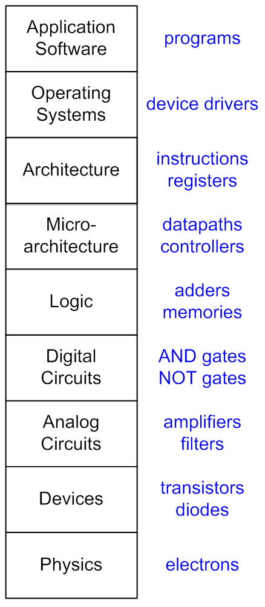
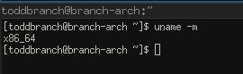

title = 'Course Introduction. Computer Structure.  Architecture vs Microarchitecture.  RISC vs CISC.' 

# Lesson 1 Notes

## Readings
- [Embedded System](http://en.wikipedia.org/wiki/Embedded_system)
- [Complex Instruction Set Computing](http://en.wikipedia.org/wiki/Complex_instruction_set_computing)
- [Reduced Instruction Set Computing](https://en.wikipedia.org/wiki/Reduced_instruction_set_computing)
- [RISC vs CISC](http://www-cs-faculty.stanford.edu/~eroberts/courses/soco/projects/risc/risccisc/)

## Assignments
[Skills Review](skills_review.html)

## Lesson Outline
- Course Intro
- Instructor Intro
- Admin
- Structure of a Computer
- Architecture vs Microarchitecture
- RISC vs CISC

## Course Intro
*[Take roll - use icebreaker questions from sheet.]*

Welcome to ECE382, Embedded Systems I.  First things first - what have you heard about this class?!

We're going to learn about computers - how they work and how we use them to accomplish tasks.  Specifically, we'll work with small computers called microcontrollers.

In this class, we'll be:

- Writing programs in Assembly Language, then C
- Learning about and using the functional units of a microcontroller
- Using the microcontroller to interface with peripheral devices

My goal is for you to leave this course with enough knowledge to be confident you can use microcontrollers in your future projects and enough excitement that you actually **want to**.

Did anyone do the reading for today?!  Readings / Assignments in the lesson notes on the course website.

So if you read, what are embedded systems?  You're familiar with general-purpose computers - devices that are designed to be flexible and accomodate a wide range of needs.

Embedded systems are different - they're built to interact with the real-world and perform very specific functions, often with difficult contraints (timing, power, etc).  These are the systems that monitor the engine temperature in your car, power your digital watch, the brains of your microwave, etc.  Or perform functions in manufacturing lines, power plants or water treatment facilities.

I think that this area of computing is going to be a big part of the future.  
[Swarm of Quadrotors](http://www.youtube.com/watch?v=YQIMGV5vtd4)

But even if you don't agree with this vision, learning about computers at a low level gives you a great insight into how these machines actually work.  You'll develop skills that will make you a better engineer, regardless of your ultimate focus.

We're going to get very hands-on and expect you to build things that actually work.  By the end of the semester, you'll program this robot to navigate this maze. 

*[Show robot]* - and if you win, you'll get your name on the wall - we've been running the maze competition since 1997.

## Instructor Intro

[Capt Todd Branchflower](branchflower.html) - Course Director  

*[My slides]*

Capt Branchflower - I have an interest in Linux and low-level systems programming.  The stuff we teach in this course is extremely relevant to that.  The knowledge you'll learn about low-level computers is the same stuff that higher-level computers operate on.

## Admin
There have been a **ton** of changes in this course from last year to this.  We've changed the platform and IDE for probably the first time in almost 10 years.  We're introducing the C programming language earlier than we ever have before.  Some of the labs are completely new - and they'll be graded differently than in years past.  I think I'm doing the course website differently than its ever been done.  If there's something going on that you don't like or you do like and want to see more of, **please tell me**.  We're going to run into problems.  There's going to be stuff that I don't know.  But stick with me and we'll make it through - and I promise you'll learn something in the process.

- Show course website, walk through structure - goal is to have everything you need on here
- Go over course goals:
    - Writing programs in Assembly Language, then C
    - Learning about and using the functional units of a microcontroller
    - Using the microcontroller to interface with peripheral devices
- Go through rough block structure of course - brief overview of each
    - Stuff due every lesson
    - Grading
    - 2 GRs, 8 Labs, HW / Quizzes
        - Must complete every Lab!
    - There is a final - no validations
- Course policies:
    - Lab
        - After hours, sign in / out on log
        - Time Logs
        - Sign out equipment!  Work with Mr. Evans
        - Lockers
        - Lab Cleanliness
    - Lab Notebooks
        - Grading
        - From ECE281, you know the standard - grading will be less forgiving in this course
        - "Securely Affixed" - tape all around, glue
        - "Hit by a Bus" standard
    - Late Policy
    - Course Text (optional!)
        - The information you need is in the datasheets, but they aren't always user friendly
        - The book definitely gives you a more digestable explanation of a lot of the features / subsystems
        - If you didn't get the book, don't expect that I'll give you what it says in EI
- Instructor policies:
    - Go over teaching schedule
    - Encouraged to bring computer to class
        - Datasheets
        - IDE
        - I want you to write code, frequently!
            - to see how things work
            - to test your assumptions
- Skills Review!
    - Due L3

## Structure of a Computer
Let's start with some perspective.  What are the key components of a computer?

*[DEMO with home-built computer]*

- CPU
    - Does the work!
- Memory (RAM)
    - Memory directly addressable by the CPU
- Motherboard - encompasses lots of different stuff
    - How everything is connected together
    - Many different interfaces
- Nonvolataile storage
    - RAM clears when it's powered off
    - If you don't want to lose your work, you need some sort of persistent storage (hard drive)

If you shrink this to a single PCB, you've got what we call a **single board computer** - I've got a Raspberry Pi.

### System on a Chip
If you take the core components from this computer, shrink them, and integrate them on a single die, you have what's known as a [System on a Chip (SoC)](http://en.wikipedia.org/wiki/System_on_a_chip).  Multiple components on a single die is the core feature here.  This is what powers your cell phones.  The Galaxy S4, for instance, has two models - one uses Qualcomm SnapDragon 600 and other Samsung Exynos 5 Octa.  They can include additional components based on application.

These SoCs have powerful CPUs and are capable of running modern software like Linux / Windows.  Typically they need external memory chips (flash, RAM) to support this software (Android, iOS, etc. need a **LOT** of RAM)- so they're not completely single-chip. 

*[In the future, would love to crack open a smartphone and show the guts]*

### Microcontrollers
When you scale this down even further (100kB of RAM or less), you reach the world of [microcontrollers](http://en.wikipedia.org/wiki/Microcontroller).  That's where we'll live this semester.  Microcontrollers typically are completely single-chip.  They're extremely low power and low cost.  But they typically come with some limitations - memory, CPU speed, onboard subsystems, etc.  Another distinction is that they're built to interact with the outside world - they have hardware support for common peripheral devices and they have a lot of input / output lines to enable them to interact with external devices.

*[Show MSP430G2553 chip]*

## Architecture vs Microarchitecture
Now, let's see where we are in the overall hierarchy of ECE - and talk about CPUs a bit more.

[Instruction Set Architecture (ISA)](https://en.wikipedia.org/wiki/Instruction_set)  
The ISA is the programmer's view of the processor.  Processors with the same ISA share the same data types, assembly lanugage instructions, registers, addressing modes, memory architecture, interrupts, IO, etc.  This is the API into the processor for the programmer - the tools the programmer has access to to accomplish what they want.

Are all processors that implement an ISA the same?  Are the Intel and AMD chips that implement x86 the same (Pentium, Athlon)?  **Pause - wait for answer**.  NO - different microarchitectures.

[Microarchitecture](http://en.wikipedia.org/wiki/Microarchitecture)  
The microarchitecture is the hardware implementation of a given ISA.  An ISA can be implemented with different microarchitectures.  This allows programmers to write software that functions on chips made by different manufacturers.

Does anyone know what ISA  / processor their computer is running?  
Mine runs x86_64:

Can anyone name any more instruction set architectures (ISA)?

- x86 - both 32(IA32) and 64(x86_64) bit
- MIPS - taught in 281 book, will be in future course offerings
- PowerPC
- Itanium
- SPARC
- ARM
- 68S12 - used in this course last semester
- MSP430 - ISA we'll use in this course
- PRISM - what you learned in ECE281

Aside from maybe PRISM, these aren't toy architectures - they're used in all sorts of devices we use everyday.

In fact, the router I use at home runs MIPS and embedded Linux.  
*[DEMO SSH into router, show processor that it's running]*

The architecture we'll use in this course is the MSP430 - it specializes in extremely low power applications.  We'll learn more about it next lesson.

### Some History - RISC vs CISC
On board - ISAs fall into two different categories, Reduced Instruction Set Computer (RISC) and Complex Instruction Set Computer (CISC).

Early in the history of computing, most programming was done using the ISA directly (assembly language).  Higher level languages (compiled - C, C++, etc interpreted - Python, Ruby, etc) weren't as widely available and the associated compilation technology wasn't as good.  Consequently, computer architects designed ISAs that included progressively higher-level programming constructs - designed to make the assembly programmer's life easier.  As a result, instructions were created that were capable of performing several low-level operations in a single step.  For example, a single instruction might load some information from memory, perform an addition operation, and store the result - taking many clock cycles.  Since instructions coded for more operations, this had the added benefit of making program length shorter - which was important because memory was expensive and slow at the time.

Brief summary on board.

Over time, people began to gravitate toward higher-level compiled languages like C for their benefits in portability and programmer productivity.  Good, portable compilers along with open operating systems had been developed and fewer programs were being written in assembly language.  So programmer convenience became less of an driving force behind ISA design.  Designers noticed that compilers didn't need many of the features meant to facilitate manual assembly programming.  They thought that these *complex* instruction could be replaced with sequences of simpler ones.  The simpler hardware would give room for more registers, reducing the number of slow memory accesses.  In these designs, instructions were typically of uniform length - allowing for better pipelining and higher clock frequences.  This strategy became known as Reduced Instruction Set Computing (RISC).

Brief summary on board.

Others thought that hardware design was more mature than compiler design and sought to implement these higher level constructs in hardware - this philosophy became known as Complex Instruction Set Computing (CISC).

RISC designers focused on architectures with a small amount of highly-optimized instructions.  They found that these could often be faster than complex instructions performing the same operation.  You'll learn a lot more about this in ECE485 with Dr. York.  But the key characteristics of RISC are a small, highly optimized instruction set, many general purpose registers, and higher clock speeds than CISC processors.  They also have longer programs lengths than CISC architectures.

CISC is characterized by a bigger instruction set, many addressing modes, instructions take multiple clock cycles, and typically slower clock speeds than RISC.

But RISC never really made it mainstream.  That's probably due to the large amount of software written for x86, a CISC architecture - only the most recent version of Windows is available on ARM.  Intel also could afford to invest a lot more in process improvements, etc. than the RISC manufacturers.  They also adapted a lot of the RISC improvements to their own architecture - CISC architectures often translate their higher-level instructions in hardware to microcode, similarly to RISC.   Now high-performing CPUs (both RISC and CISC) are all pretty similar.

x86 is still pretty dominant on PCs, but RISC has found a home in [low-end mobile systems and high-end supercomputing](https://en.wikipedia.org/wiki/Reduced_instruction_set_computing#RISC:_from_cell_phones_to_supercomputers).

In the past, we worked with the Motorola 68S12, which used a CISC architecture.  
*[Show old S12 reference book as example of volume of instructions]*

This semester, we'll be working with the MSP430.  It uses a RISC architecture.  It has a grand total of 27 instructions.

*[Show Launchpad kit]*

## Notecards

(If there's time).

- Name
- Hometown
- Hobbies / Interests
- Course Goals?
- Issues / Concerns about this course?
- Anything else I should know?

**Remainder of class, they can get moving on the Skills Review.**
