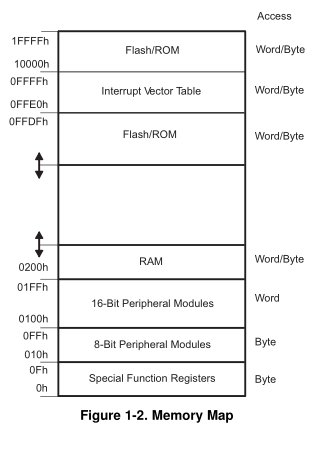
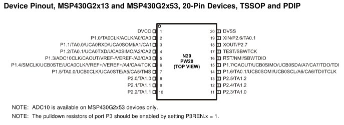
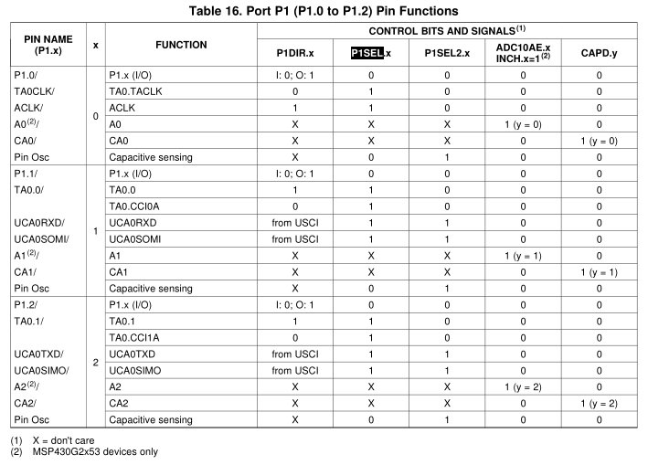

title = 'Peripherals, Ports, GPIO, Multiplexing'

# Lesson 13 Notes

## Readings
- [Memory-mapped IO](http://en.wikipedia.org/wiki/Memory-mapped_I/O)
- [ppt](Lsn13.pptx)

## Lesson Outline
- Peripherals
- Memory-Mapped IO
- Ports
- GPIO
- Multiplexing

## Admin

- Video
- Notebook due COB
- Lab
    - What did you think of the encryption lab?
    - Issues from lab
        - `.text` vs `.data`
        - Modularity
            - think about how you break your program into subroutines
            - just because it works doesn't mean your code is good
    - Bonus and weaknesses
        - Weakness: knowing that the last character is `#` and that key is two bytes
        - Techniques
            - Weakness combined with guess and check
            - Frequency analysis
            - Slow brute force
            - Fast brute force (personal favorite)
                - Big O Notation
                    - In computer science and algorithms, speed is crucial
                    - Multiply for lab 1
                        - O(n) technique
                        - O(log n) technqiue
    - Changes for next year
        - Required functionality is same
        - A functionality is B functionality
        - Bonus is A functionality
        - No # at the end of each  message - have to count bytes

So through that lab, we showed that the CPU on the MSP430 can be used to accomplish any type of general purpose programming task via its instruction set architecture (ISA).

But the power of an MCU isn't in its ability to accomplish general-purpose computing. It's meant to be embedded in the real world, interacting with peripherals without human intervention - and MCU design is finely tuned for those functions. In that regard, there's a ton of built-in hardware support to make common embedded functions fast and easy for the programmer.

Look at schedule.  Talk about upcoming lab - writing your first device drivers for LCD, push button.  Show black box.

## Peripherals

Peripherals are external stuff.  What are some peripherals you know of?  (keyboard, mouse, etc.)

Here's a rundown of some of the features that the MSP430G2xx has hardware support for [show MSP430 wikipedia](http://en.wikipedia.org/wiki/TI_MSP430):

- Watchdog Timer
- Universal Serial Communication Interface (USCI) - implements SPI and I2C protocols
    - We'll use SPI to interface with the LCD in your black box
- Pulse Width Modulation (PWM) - we'll use this later to drive the robot
- Temperature Sensor
- Capacitive Touch I/O
    - For working with touch screens, etc.

Explain PWM using two signals of varying duty cycle.  Explain how this mimics analog voltages for digital systems.

Different variants of the MSP430 support a huge array of peripherals.

Even within the MSP430, there is a ton of diversity in the peripherals that different variants support. That's where scoping the problem you're trying to solve is important. You want all of the features you need, but don't want to pay for additional hardware that you'll never use. More features = more expensive.

If you look in the User's Guide, you'll notice a range of peripherals that the MSP430G2553 doesn't support - but other members of the family do.

Remember how you had to implement multiplication in software in Lab 1 - "Calculator" - (for A Functionality)? There are variants of the MSP430 that come with hardware multipliers that support multiply instructions.

Most of these features are beyond the scope of this class. But we'll introduce you to a couple and give you the tools to learn more about the peripherals you'll need for future projects.

## Ports

A port is in interface between the computer and other computers or peripheral devices.  What are some ports you've heard of?  (USB, ethernet, VGA, HDMI, RS-232, etc.)

In the MSP430, a port is a grouping of pins used for interfacing with other devices.  By default, on your Launchpad board you've got access to Port 1 Pin 0 - Pin 7 and Port 2 Pin 0 to Pin 5.  Port 2 actually has 8 total pins, but the DIP packaging doesn't give you access to all of them by default.  If we need, we can get access to the others using multiplexing (which I'll talk about later).  The largest MSP430 devices go up to P11.

The different features of MSP430 chips we just talked about are made available to peripherals through these pins.

## Two Techniques for IO

So how do we interact with these ports / features?  In the MSP430, we use specialized registers that have their own locations in the MSP430 memory map.  This is known as memory-mapped IO.

*[Show Family Users Guide, some registers and memory locations]* - Watchdog Timer, Digital IO

### Memory-Mapped IO

Motorola originally pushed this method.

IO and memory share the same address space.  Peripherals are mapped to specific addresses in the MCU address space.



Watchdog Timer in 16 bit peripherals.  Digital IO in 8 bit peripherals.

Advantage: 

- Fewer instructions
- Can use the same addressing modes for IO as for other instructions

Disadvantage:

- Lose memory to IO.
- Doesn't protect programmer from mistakes.

### Isolated IO or Port-mapped IO

Intel originally pushed this method.

Special set of instructions for manipulating IO - found on Intel microprocessors.  IO also resides in its own, separate address space.

Advantage:

- Don't lose memory for IO.
- Protects coder from mistakes.

Disadvantage:

- Need more instructions.
- Different address spaces / modes for IO.

## GPIO

Ports are often used for implementing specific interfaces.  When they're not used for that, you can use them for whatever you want 

General Purpose Input Output (GPIO) is the default peripheral available on your ports.  When configured in output mode, this allows you to drive each bit / pin individually to logic high or low.  When configured in input mode, you can read logic high or low from an external source.  It's perfectly acceptable to have some pins be output and others input on the same port.

The registers used to configure GPIO are PxDIR, PxOUT, and PxIN.

- PxDIR configures which pins are input and which pins are output - 1 corresponds to output, 0 to input
- Writing to PxOUT controls the output of each pin
- PxIN allows you to read the values on these pins
- PxREN controls pull up / pull down resistors to avoid floating inputs.

*[Look them up in the Family User's Guide]*

- Show default values that GPIO resets to

There are additional registers that control other characteristics of GPIO, but we'll stick with these for now.

Let's use this to write a program that controls the onboard LEDs on our launchpad with the onboard push button.  *[Work through this with the class]*.

```
                     bis.b  #BIT0|BIT6, &P1DIR
                     bic.b  #BIT3, &P1DIR
 
check_btn:    bit.b  #BIT3, &P1IN
                     jz            set_lights
                     bic.b  #BIT0|BIT6, &P1OUT
                     jmp           check_btn
set_lights:   bis.b  #BIT0|BIT6, &P1OUT
                     jmp           check_btn
```

Why doesn't this work?  Push button is low on push and *floating* on release.  We have no idea how the MCU will interpret the button when it's up.  We need to add a pull-up resistor!  A pull-up resistor will push a pin to logic high if it's floating - but it's not powerful enough to overwhelm a true logic low signal.  The reverse is true for pull-down resistors.

If a pin is configured as input, PxOUT has a dual purpose - setting the appropriate bit to 1 configures it as pull-up, while clearing it configures it as pull-down.  The PxREN register enables / disables the pullup/down networks.

```
                     bis.b  #BIT0|BIT6, &P1DIR
                     bic.b  #BIT3, &P1DIR
                     bis.b  #BIT3, &P1REN
                     bis.b  #BIT3, &P1OUT
 
check_btn:    bit.b  #BIT3, &P1IN
                     jz            set_lights
                     bic.b  #BIT0|BIT6, &P1OUT
                     jmp           check_btn
set_lights:   bis.b  #BIT0|BIT6, &P1OUT
                     jmp           check_btn
```

There are some things going on here that might be confusing.  Let me explain:

When the button is pushed, it drives P1.3 low.  When the button is released, it leaves P1.3 floating.  This is a problem.  We need P1.3 to be logic high when the button isn't pushed.  What can we do?

Add a pull up resistor!  And, with the MSP430, we can do this internally.  The P1REN register enables / disables the pull up / down resistors.  I set BIT3 to enable it.  Next, I have to make it pull-up.  If a pin is configured as input, the corresponding bit on P1OUT determines whether it is pull up or pull down - setting it to 1 makes it pull up.


**PITFALL!**
```
    mov.b   #0xff, P1DIR        ; PC-relative addressing is a **bad idea** for addressing peripheral registers
```

Since you have complete control, GPIO is infinitely flexible.  If the MCU you're using lacks a peripheral implementing a certain protocol and it's impractical to get one that has it, it's always possible to bit-bang the protocol.  That involves driving GPIO to achieve the individual bits you need to communicate.

## Multiplexing

Pins are expensive - and most applications won't use all of the features available in a chip for a single application. So designers save on cost by making many different functions available on the same pin.

Some dev boards give you a ton of pins *[show S12 dev board]*.  Ours does not.

Remember the pinout for our MSP430G2553:



We can only use a port for one purpose at a time. So we need a way to select the particular function we want a pin to perform. We accomplish that via the PxSEL and PxSEL1 registers. Different combinations of these bits make different functions available on a pin. The details are in the [MSP430G2x53 2x13 Mixed Signal MCU Datasheet](/datasheets/msp430g2x53_2x13_mixed_sig_mcu.pdf).

Here's an example from the datasheet:



Let's say I wanted to make the UCA0SOMI function available on P1.1. Here's the code I'd use:

```
; 'from USCI' means this bit is set automatically by the USCI when enabled
    bis.b   #BIT1, P1SEL   
    bis.b   #BIT1, P1SEL2

; others are set correctly by default - you should set them if previous code used them
```

Next lesson, we'll learn about using a technique called polling to accept input from peripherals.
