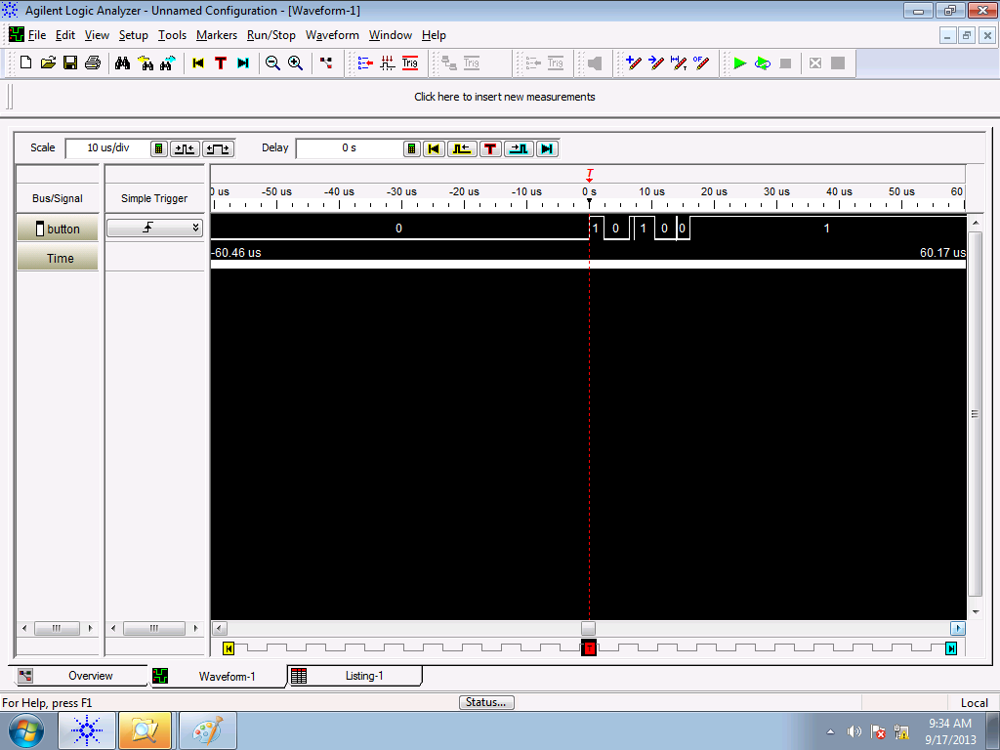
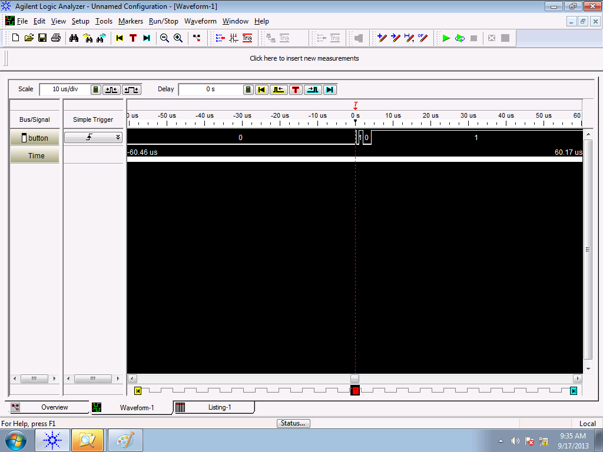
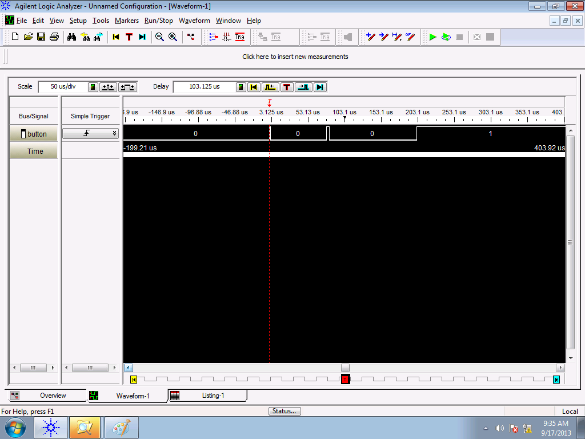
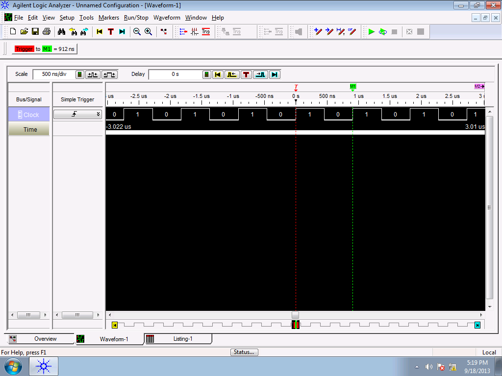
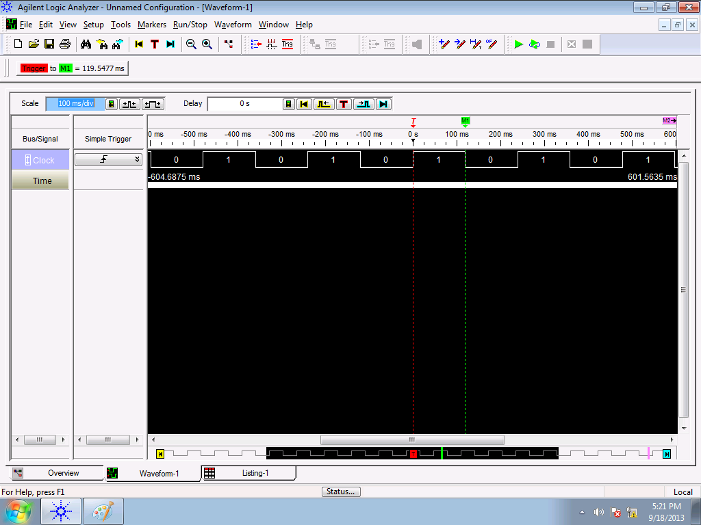
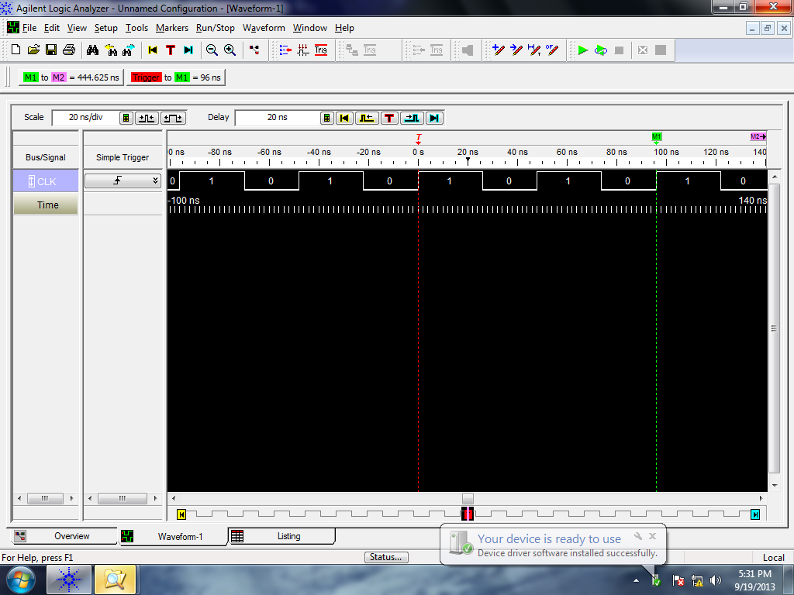

title = 'Polling. Debouncing. Software Delay Routines.'

# Lesson 14 Notes

## Readings

Just some motivational stuff today!

Tutorial on MSP430-based quadcopter:

- [Hack-a-Day Writeup](http://hackaday.com/2011/06/27/msp430-based-palm-size-quad-copter/)
- [Full Tutorial](http://www.rcgroups.com/forums/showthread.php?t=1335765)
 
Videos of cool MSP430 project:

- [LED Cube](http://www.youtube.com/watch?v=Jr50gT5O5IE)
- [Playing Music](http://www.youtube.com/watch?v=5A3bBXRpYCI)
- [Hacking an RC Car](http://www.youtube.com/watch?v=SPbOUqOpu3I)
- [Interactive Periodic Table](http://www.youtube.com/watch?v=s0c2vkO8tck)

## Assignment

Very short assignment:

[What does this subroutine do?](L14_subroutines.html)

## Lesson Outline
- Polling
- Intro to Logic Analyzer
- Debouncing
- Software Delay Routines

## Admin

- Move class to lab.
- Did you watch the videos in the reading?  Cool, right?  Show some if most people haven't.
- Short assignment due next time.  (Click assignment).  I'm giving you some code generated by a real C compiler and disassembled - I want you to tell me what it does.
- I'll get lab notebooks back to you next time.
- Go over better PB-LED code from L13.

## Polling

*[Go around the room repeatedly asking each student if they have a question]*

That's an example of polling.  Polling is the act of repeatedly querying a peripheral to see if it has information for you.

Does that seem particularly efficient?  What's a better method?  Waiting for someone to **interrupt** me by raising their hand and handling the request then.  Interrupts are how computers actually work and make it seem like multiple programs are running simultaneously when only one can use the CPU at a time.  We'll learn about interrupts later in the semester, on Lesson 27.

But if the CPU doesn't need to be doing anything else, polling is a straightforward and effective method.  Let's say I wanted to write a little code to poll my Launchpad for when the button is pushed.  How might we do this?
```
                     bic.b  #BIT3, &P1DIR
                     bis.b  #BIT3, &P1REN
                     bis.b  #BIT3, &P1OUT
 
poll_button:
                    bit.b    #BIT3, &P1IN             
                    jnz      poll_button            ; button is active-low

forever             jmp     forever                 ; set break here
```

*[Run, pause.  Run, pause.  Push button - BREAK]*

In Lab 3, you're going to be polling buttons for presses from a person to capture inputs.

## Intro to Logic Analyzer

A tool you're going to be using a lot in Lab 3 and in the future is the Logic Analyzer.  It's a tool that engineers use to measure digital signals - kind of the O-scope equivalent for digital engineers.  By hooking the wires of the pods up to the pins you want to measure, you can see what's going on with your system.  You can measure up to 32 distinct digital signals - much more than an O-scope.

Today, I'll use it to demo how to measure a few signals.  Let's start with examining how a button works and some pitfalls we might encounter.

## Debouncing

### Bouncing

The buttons you'll be using in Lab 3 are mechanical - and they have the tendency to bounce up and down before reaching a steady state.

*[Draw picture on the board]*

That's the concept, but let's look at how the concept manifests itself in the real world with the Logic Analyzer.

*[Use logic analyzer to demonstrate what button bouncing looks like, how unpredictable it can be]*







What's a potential problem that could arise from this button bouncing?

```
                     bis.b  #BIT3, &P1OUT
                     bis.b  #BIT3, &P1REN
                     bic.b  #BIT3, &P1DIR
 
                     clr           r4
 
check_btn:    bit.b  #BIT3, &P1IN
                     jz            btn_pushed
                     jmp           check_btn
 
btn_pushed:   inc           r4
wait:         bit.b  #BIT3, &P1IN
                     jz            wait
                     jmp           check_btn
```

Your MSP430 is extremely fast - you could interpret a single button push as multiple pushes of the same button.  This error is extremely common.  How can we deal with it?

### Debouncing Strategies

There are a few techniques to deal with this problem - some in hardware, some in software.  I'll present one simple technique that is effective.

**Delay until bouncing has stopped**

Once I sense a button release, I can put the CPU into an idle loop for a period of time until I'm confident that the bouncing has stopped:

```
                     bis.b  #BIT3, &P1OUT
                     bis.b  #BIT3, &P1REN
                     bic.b  #BIT3, &P1DIR
 
                     clr           r4
 
check_btn:    bit.b  #BIT3, &P1IN
                     jz            btn_pushed
                     jmp           check_btn
 
btn_pushed:   inc           r4
wait:         bit.b  #BIT3, &P1IN
                     jz            wait
                     call   #software_delay
                     jmp           check_btn
 
software_delay:
                     push   r5
                     mov.w  #0xaaaa, r5
delay:               dec           r5
                     jnz           delay
                     pop           r5
                     ret
```

What are some potential problems with this?

- You could delay for too short a period and still be impacted by bouncing.
- You could delay for too long a period and miss good button pushes.

I'll leave it to you to experiment with other approaches.

## Software Delay Routines

The technique I just used is called a software delay.  Software delays are very common in embedded computing in order to achieve very precise timing constraints that are imposed by peripheral devices (device driver software).  You'll need to use software delays in Lab 3 to interface with the LCD.

This all begs the question - how do I know how long my software delay is?  I need to be **precise** or peripherals aren't guaranteed to work.

Here's our software delay code:
```
                     call   #software_delay

software_delay:
                     push   r5
                     mov.w  #0xaaaa, r5
delay:               dec           r5
                     jnz           delay
                     pop           r5
                     ret
```

How can we figure out how long this takes?

**MSP430 Family Users Guide, pp60 for cycles per instruction**

```
                     call   #software_delay         ; 5 cycles

software_delay:
                     push   r5                      ; 3 cycles
                     mov.w  #0xaaaa, r5             ; 2 cycles
delay:               dec           r5               ; 2 cycles?  no, 1 cycle!  tricky, tricky!
                     jnz           delay            ; 2 cycles
                     pop           r5               ; 2 cycles
                     ret                            ; 2 cycles?  no, 3 cycles!  tricky, tricky!
```

So I've got 5 + 3 + 2 + (0xaaaa * (1 + 2)) + 2 + 3 = 131085 total clock cycles.  Only a portion of this is directly related to the 0xaaaa I'm using, so this is tunable to within 4 clock cycles of a precise delay.

But how long is this?  How do I know the exact time?  I need to know my clock period.

To implement its clock, the MSP430 uses a Digitally Controlled Oscillator (DCO).  An advantage is that it's tunable and can run at many different frequencies.  But it's an RC oscillator, so it can be inaccurate - a problem when we need to know the length of a clock cycle to the nanosecond. The default frequency is around 1MHz, but there's significant variance (0.8MHz - 1.5MHz) across chips.  This is remedied by calibrating it with a more accurate quarz crystal resonator (like the ones used in your watches) at the factory.  TI stores the proper calibrated values for DCOCTL and BCSCTL1 for 1MHz, 8MHz, 12MHz, and 16MHz in protected memory.

We can measure our clock speed by exposing the SMCLK on P1.4 using the knowledge we gained last time!

Show L13 notes about Multiplexing and find SMCLK on pinout, look up P1.4 in device-specific data sheet.
```
                bis.b	#BIT4, &P1DIR
                bis.b	#BIT4, &P1SEL

forever         jmp     forever
```

Measure on logic analyzer.



So I see my clock period - 912 ns.

So my delay should be 131085 clock cycles * period - 119.54 ms.  How can I measure this?  Let's try a simple way using GPIO!

```
                     bis.b  #BIT0, &P1DIR
here:                bic.b  #BIT0, &P1OUT
                     call   #software_delay
                     bis.b  #BIT0, &P1OUT
                     call   #software_delay
                     jmp    here

software_delay:
                     push   r5
                     mov.w  #0xaaaa, r5
delay:               dec           r5
                     jnz           delay
                     pop           r5
                     ret
```

And here's the result:



It matches - cool!

Next lesson, we'll learn about the Serial Peripheral Interface (SPI) - which the MSP430 has hardware support for.  You'll need all of this knowledge to configure / use the SPI subsytem on Lab 3.

## Bonus Material - Overclocking

If you're interested in computers, you've probably heard the term **overclocking** - that's driving your computer's CPU at a clock speed higher than what the manufacturer recommends.  In doing this, there's the potential to fry your CPU - usually because you can't dissipate all of the heat that's generated quickly enough.

As I said earlier, the clock on the MSP430 is configurable.  Like the variance in the base clock frequency, the max frequency you can get also varies across chips.  Check out the Family Users Guide section on the Basic Clock Module for more info.

Here's some code that drives the clock to its highest possible speed:
```
            bis.b	#BIT4, &P1DIR	                        ; show SMCLK on P1.4
            bis.b	#BIT4, &P1SEL

            bis.b	#DCO2|DCO1|DCO0, &DCOCTL                ; drive clock at fastest possible settings
            bis.b	#RSEL3|RSEL2|RSEL1|RSEL0, &BCSCTL1

forever     jmp     forever 
```

And here's the resulting Logic Analyzer reading:



Our clock period is 48ns - a max clock speed of 20.83 MHz!
