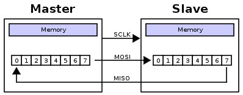
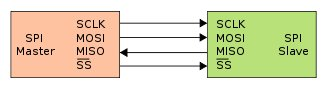
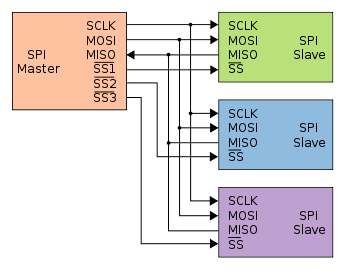
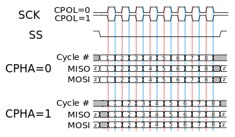
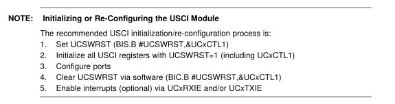
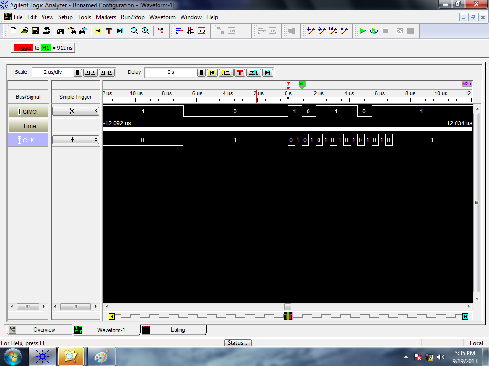
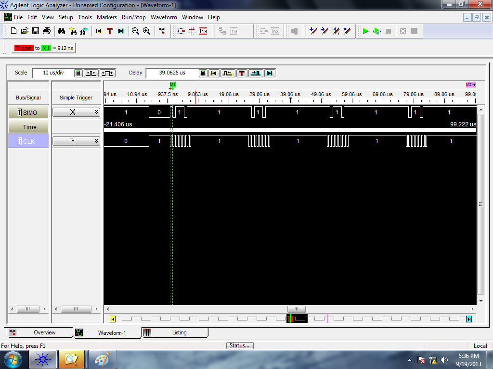
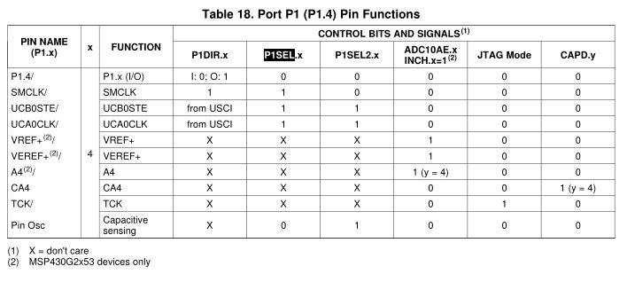

# Lesson 15 Notes

## Readings

- [Serial Peripheral Interface (SPI)](http://en.wikipedia.org/wiki/Serial_Peripheral_Interface_Bus)
- [Lab 3](/labs/lab3/index.html)

## Assignment
- [Lab 3](/labs/lab3/index.html) Prelab

## Lesson Outline
- Serial Comm Fundamentals
- Serial Peripheral Interface (SPI)
- SPI on the MSP430
- [Lab 3](/labs/lab3/index.html) Introduction
- Logic Analyzer Demo

## Admin

- Class in Lab again!
- Collect HW, then talk about it.
- (M4) - talk about timing error in software delay from last class.
- Talk about bonus overclocking stuff from L14?

*[Syllabus on big screen.]*  Three full lessons for [Lab 3](/labs/lab3/index.html)!  This doesn't mean that you've got some time to relax - this means that [Lab 3](/labs/lab3/index.html) is a lot of work.  I'll discuss it more at the end of the lesson, but you'll be interfacing with external hardware for the first time in this lab.  To interface with the LCD, you need to use a protocol call SPI - the Serial Peripheral Interface.  That's what we'll talk about today.

Everything we do today will prepare you for [Lab 3](/labs/lab3/index.html).

## Serial Comm Fundamentals

Serial Communications typically involve using a single wire for data transmission as opposed to multiple wires in Parallel Communications.

Advantages:

- Simplicity in the interface - less hardware (pins)
- Typically faster clock speeds (don't have to worry about crosstalk, etc.)

Disadvantage:

- On-chip hardware to encode / decode serial signal

Can anyone name any serial protocols?

Our MSP430 is very pin-limited.  A serial protocol is beneficial in this circumstance because it uses less pins that could be devoted to other purposes.  Attempting to drive a parallel interface would use up almost all of our available pins.

*[Show parallel interface for the LCD (actually pull LCD out of black box)]*

How many pins would we have left over for other stuff if we wanted to drive this LCD?  Not many!  So we've got to do something different.

## Serial Peripheral Interface (SPI)

In Lab 3, we're going to drive our LCD using the Serial Peripheral Interface (SPI).  On the black box, there is a chip that accepts SPI and outputs in parallel to drive the LCD.  We can use this to save pins!

SPI is probably the simplest peripheral interface there is.  It involves chaining shift registers on two devices together along with a clock.  With each clock cycle, a single bit transferred from the MSB of one shift register to the LSB of the other.  After 8 clock cycles, an entire byte has been transferred between the chips.

Is this a half-duplex or full-duplex protocol?



It involves two devices - a master and a slave - and four signals:

- Master Out Slave In (MOSI)
- Master In Slave Out (MISO)
- Clock
- Slave Select (SS)

There are other variants and naming conventions, but this is the standard.

It's the job of the master to provide the clock signal to the slave so that transmissions can be synchronized.  The master sets all clock characteristics - frequency, phase, polarity - but must make sure they are within the slave parameters.

Here's a sample of how you might wire up a SPI interface:



The Slave Select signal allows the master to potentially use the same interface to potentially interact with multiple slaves.  It's usually **active low**.



For some reason, TI names these signals differently:

- MOSI = SIMO
- MISO = SOMI
- CLK = CLK

TI's SPI subsystem also provides a Slave Transmit Enable (STE) bit - this reverses the typical functionality of SS.  STE allows a slave to select from amongst multiple masters.  **Extra credit to the cadet who figures out the common use case for this.**

In the lab, we'll want standard SS functionality - so we'll configure SPI in a 3-pin mode and provide the SS via GPIO.

Hardware support for SPI on MCUs is usually very flexible.  There are configuration bits in the SPI control registers that can control all of these characteristics.  This is because peripherals use a wide range of SPI configurations - it's critical that you read the datasheet for the SPI component you're trying to interface with and match its expectations. 

**Talk about different configurable elements**

- Clock frequency
- Clock polarity
- Clock phase



On the MSP430:

- MSB first or LSB first
    - NOTE: you'll pretty much always want MSB first, which isn't the default
- 8-bits or 7-bits per transmission
    - 7-bits is justified toward the LSB
- 3-pin or 4-pin modes

## SPI on the MSP430

### Universal Serial Communication Interface (USCI)

Your MSP430G2553 comes configured with two Univeral Serial Communication Interfaces (USCI), A and B.  These are essentially hardware state machines that can be used for multiple protocols - making it extremely easy to implement the protocols.  Their function is configured using a couple of control registers.

A and B have slightly different capabilities - which you can read about in the datasheet - but they function identically for SPI.  They are referred to as `UCA0` and `UCB0`.  If there are multiple A and B interfaces, the numbers go up sequentially.

In the template code I provide you for Lab 3, you'll use `UCB0`.

**Open datasheet - talk about control registers (pp444)**

### Configuring the USCI for SPI

In the MSP430 Family Users Guide, they offer a suggested SPI initialization sequence:



**Step 1**

Setting the UCSWRST bit in the CTL1 register resets the subsystem into a known state until it is cleared.  All the registers will hold their default values.

**Step 2**

Set the appropriate bits in the control registers to configure our signal the way we want.

Remember, you've got to set UCSYNC for the system to function!  Other settings are based on your particular application.

- CTL0
- CTL1
- UCBRx high and low butes
- STAT

**Step 3**

All the ports on our MSP430 are multiplexed!  We need to set the PxSEL and PxSEL2 ports so that we have access to the SPI signals we need!

*[Show device-specific datasheet.]*

**Step 4**

Clear the UCSWRST bit in the CTL1 register - releases the system to operate.

**Step 5**

Use the subsystem!

To send a byte, just write to the TXBUF register.  To read a received byte, read from the RXBUF register.

But you can't write to them whenever you want - there could be an ongoing transmission.

You've got to monitor the flags in the IFG2 register (pp 447) to know when it's safe the send.

- TXIFG
    - Set when TXBUF is ready for a byte
    - Cleared on write
    - Just because the TXBUF is ready for another byte doesn't mean that the transmission is complete!  It's double-buffered!
- RXIFG
    - Set when RXBUF has received a complete character
    - Cleared on read
    - This is what you should monitor to determine a transmission has completed!

An example of SPI configured and sending some characters:
```
        bis.b #UCSWRST, &UCA0CTL1

        bis.b #UCCKPL|UCMSB|UCMST|UCSYNC, &UCA0CTL0     ; don't forget UCSYNC!

        bis.b #UCSSEL1, &UCA0CTL1                       ; select a clock to use!

        bis.b #UCLISTEN, &UCA0STAT                      ; enables internal loopback

        bis.b #BIT4, &P1SEL                             ; make UCA0CLK available on P1.4
        bis.b #BIT4, &P1SEL2

        bis.b #BIT2, &P1SEL                             ; make UCA0SSIMO available on P1.2
        bis.b #BIT2, &P1SEL2

        bis.b #BIT1, &P1SEL                             ; make UCA0SSOMI available on P1.1
        bis.b #BIT1, &P1SEL2

        bic.b #UCSWRST, &UCA0CTL1                       ; enable subsystem

send    mov.b #0xBB, &UCA0TXBUF                         ; place a byte in the TX buffer


wait    bit.b	#UCA0RXIFG, &IFG2                       ; wait for receive flag to be set (operation complete)
        jz	 wait


        mov.b	&UCA0RXBUF, r4                          ; read RX buffer to clear flag
        jmp	send                                        ; send another byte

```

Here's what a single send of `0xBB` looks like on the Logic Analyzer.  Note how our clock is 912ns - because we chose the SMCLK to be our clock source.  Note how the clock default state is high and data is read on the second clock edge - consistent with our settings.



Zoom out a little - and here's what it looks like to send `0xBB` repeatedly:



### Monitoring SPI Status

The MSP430 uses a double-buffered system to implement SPI - meaning you do not have direct access to the SPI shift registers.

The buffers you write to for transmission (TXBUF) are copied into the shift register when it's ready for the next byte.  This does NOT mean that the transmission has completed - just that the buffer is ready to accept another byte.

The buffers you receive from (RXBUF) are copied from the shift register when a full byte has been received.  This indicates that the full byte has been transmitted and received.

Their status can be monitored using flags TXIFG and RXIFG, both in IFG2.  If you're trying to wait until the entire byte has been transmitted, you want to monitor the RXIFG flags, depending on the USCI you're using.  If you don't care and just need to fill the TX buffer whenever it's ready for my data, you should monitor the TXIFG.  The `SPISEND` subroutine in Lab 3 demonstrates this.

## [Lab 3](/labs/lab3/index.html) Introduction

[Lab 3](/labs/lab3/index.html) is your first opportunity to interface the MSP430 with external hardware - we'll be using pushbuttons and an LCD.  **It's a long lab**.  You'll need all the time, so make sure you don't fall behind.

You're going to be using push buttons to select a key and message, then use your subroutines from Lab 2 to attempt to decrypt the selected message with the selected key.

There is a lot of information on the lab handout and in the links included in the lab handout - **you'll need it**.  Follow it closely.

I've given you template code - **USE IT**.  It will make your life much, much easier.

Datasheets you'll need are on the course website.

Describe required functionality.

Describe B functionality.

Describe A functionality.

## Logic Analyzer Demo

Let's walk through the majority of your prelab right now by doing Step 1 of [Lab 3](/labs/lab3/index.html).  Here's what it says:

> **Step 1**: The Subsystem Master Clock (SMCLK) is the same speed as the Master Clock (MCLK) that runs your CPU.  Measure its period via logic analyzer - you'll want to screen capture / print this for your lab notebook.  There will be a table on the board for all students to record their CPU speed - record yours there.  **Never forget to ground your logic analyzer**.

If you know what to do, you don't have to listen and can work at your own pace.

Remember, the pins on our MSP430 are multiplexed because we don't have many.  We need to write some code to make it available on one of our pins so we can measure it.  Here's the MSP430G2553 pinout:


Looks like the SMCLK is available on P1.4 if I set the P1DIR, P1SEL, and P1SEL2 registers properly.  To the Users Guide!



Using this, here's the code we need to get access to SMCLK:
```
            mov.b   #BIT4, &P1DIR
            mov.b   #BIT4, &P1SEL

forever     jmp     forever
```

After we program our device, we'll use the Logic Analyzer to look at the signal and do some measurements.

I'll hook up the black Ground wire on Pod 1 to ground on the MSP430.  I'll hook up Pod 1 Wire 0 to P1.4 - the signal I'm trying to measure.

I'll go into the bus screen and select Pod 1 Wire 0 as the signal I'm trying to look at, then name the signal SMCLK.

Next, I'll go into the sampling setup screen and set the sampling speed to be the fastest possible (once every 2ns).  Since this is a fast signal, I want to get the most accurate data possible.

Finally, I'll go into the Waveform screen and set the trigger on my signal to be falling edge.  I'll push the Run Single button and the trigger should hit instantaneously.

Now, I can see the shape and period of the SMCLK signal.  I'll drag my markers to measure falling edge to falling edge - and the distance between the markers will show at the top of my screen.  That's the period of my SMCLK.

1/period = frequency - now I know the frequency of my SMCLK!

Your clock speed will most likely be slightly different from mine because there is variability across MSP430 chips - so you'll have to perform this process yourself and record your results.  You'll also have to use this process to measure the length of your delays to ensure they satisfy the Lab requirements.

More information on using the [Logic Analyzer is available here](/labs/lab3/logic_analyzer.html).
