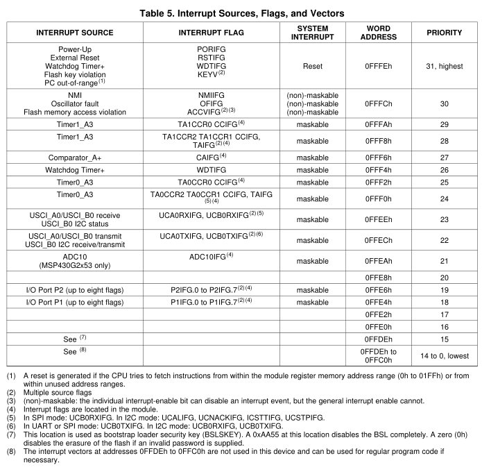
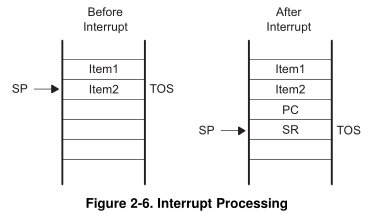

title = 'Interrupts and ISRs.  MSP430 Interrupt System.'

# Lesson 27 Notes

## Readings
- [Interrupts](http://en.wikipedia.org/wiki/Interrupt)
- [Interrupt Handler](http://en.wikipedia.org/wiki/Interrupt_handler)

## Lesson Outline
- Admin
- Interrupts
- Using Interrupts

## Admin

How was the lab?  People getting more comfortable using git / Github?  How was including the button library?  See the value of creating reusable libraries?

**Policy on Sharing Code**

I encourage you to use Github to browse code for ideas and assistance - this is consistent with the cooperative ethos of engineering.  That does not mean you're free to copy the code of your classmates.  **I expect you to document any assistance you get.  I expect any code you turn in to be your own, unless I explicitly allow you to use the libraries of others.**  Any questions? 

There are only two lessons between now and Lab 5, which covers interrupts.  You will need the knowledge from the them to be successful on the lab.  You'll only get one in-class lesson for Lab 5 - so pay attention today and next time so you're prepared!

## Interrupts

To this point, we've only used polling to query the state of buttons, subsystems, etc.

What's the problem with that?

**It's inefficient!**  In the time we spent polling the state of our device, the CPU could be freed to do more useful work.  It could also be put in a low-power mode until activity on our device wakes it back up - critical in devices that must conserve power.

Polling is like me spending the entire class period asking if each student in class has a question.

What's the alternative?

**Interrupts**.  Interrupts are closer to you raising your hand when you have a question.  I'm freed to do other things until you interrupt me, at which time I can handle your question before picking up where I left off.

Interrupts signal an event that requires an immediate response.  Example: A hardware timer has overflowed, indicating your device must awake from a low power mode and perform a task.

When an interrupt is requested, the processor stops what it's doing, stores enough information so it can restore its current state.  It then executes some predefined piece of code called an **Interrupt Service Routine (ISR)** designed to respond to the event.  Once it's finished, the CPU restores its previous state and continues what it was previously doing.  ISRs are like subroutines called at unpredictable (to the CPU, at least) times.

Interrupts serve two main purposes:

- To execute some predefined subroutine based on an event
- To wake up the MSP430 from a low-power mode

Interrupts are how the operating system on your computer implements time-sharing (sharing the CPU between multiple programs).  It will give a program control of the CPU and schedule an interrupt for some time in the future.  When the interrupt fires, it transfers control to another program.

### What Happens On RESET

You're using interrupts already and don't even know it.

What happens when you push the RESET button on your chip?

It triggers an interrupt!

The CPU notices that the RESET interrupt has occurred.  In response to the interrupt, the CPU consults its **Interrupt Vector Table**.  This is the table that holds the addresses of the ISR to be executed as a result of each interrupt.  It finds the vector that corresponds to the pending interrupt and executes the code there.

Remember this code that was automatically generated in your assembly projects?

```
RESET       mov.w   #__STACK_END,SP         ; Initialize stackpointer
StopWDT     mov.w   #WDTPW|WDTHOLD,&WDTCTL  ; Stop watchdog timer

;
;           YOUR CODE
;

;-------------------------------------------------------------------------------
;           Interrupt Vectors
;-------------------------------------------------------------------------------
            .sect   ".reset"                ; MSP430 RESET Vector
            .short  RESET
```

This is storing the RESET label (the address of the start of your code) as the vector for the reset interrupt!  It tells the MSP430 to execute your code whenever that interrupt is triggered.

That's why it was a big problem if you accidentally deleted some of the boilerplate or deleted the RESET label!

### Interrupt Vectors

There are a whole bunch more interrupt vectors we have access to!  Back to our memory map:


At the highest addresses, there is a block reserved for the Interrupt Vector Table.

Here's some more detail on that block for the MSP430G2553:



Interrupts we can respond to:

- GPIO
- Analog-to-Digital Conversion
- Communications Interfaces (USCI)
- Timers

So when a given interrupt is triggered, the CPU knows to go to the associated vector to find the address of the ISR to be executed in response.

These are the source of all the warnings you get about not implementing ISRs when you compile your C code.

### Interrupt Priority

Interrupt priority dictates which interrupt is taken when multiple interrupts are pending simultaneously.  The interrupt with the highest priority will be handled first.

### What Happens On Interrupt

**On Interrupt:**

1. Currently executing instruction is completed.
2. PC is pushed onto the stack.
3. SR is pushed onto the stack.
4. Selects highest priority interrupt.
5. If single interrupt, interrupt request flag reset.  Multiple interrupts, flag remains set.
6. SR is cleared - terminates low-power mode and disables maskable interrupts.
7. Interrupt vector content loaded into PC.



**On ISR Completion:**

1. Pop SR off stack - restoring prevous settings.
2. Pop PC off stack - resume exection at previous point.


### Maskable vs Non-maskable Interrupts

Besides RESET, there are two types of interrupts - maskable and non-maskable.

Just like it sounds, it's not possible to ignore non-maskable interrupts.  If they're enabled and the interrupt occurs, their ISR will be triggered.

Maskable interrupts are different.

Remember the status register from L6?

| 15 | 14 | 13 | 12 | 11 | 10 | 9 | 8 | 7 | 6 | 5 | 4 | 3 | 2 | 1 | 0 |
| :-: | :-: | :-: | :-: | :-: | :-: | :-: | :-: | :-: | :-: | :-: | :-: | :-: | :-: | :-: | :-: |
| Reserved	colspan=7 | V | SCG1 | SCG0 | OSCOFF | CPUOFF | GIE | N | Z | C |

We're going to revisit one of the bits we ignored when we first covered it - General Interrupt Enable (GIE).

Setting this bit enables maskable interrupts, clearing it disables maskable interrupts.  So this gives us the ability to programmatically enable / disable maskable interrupts.

If you remember back to the MSP430 instruction set, these actions had their own emulated instructions: `EINT` and `DINT`.

Our headers give us access to a macro in C that allows us to call these instructions directly: `__enable_interrupt()` and `__disable_interrupt()`.  This comes from the `intrinsics.h` header - which gives access to architecture-specific instructions.

GIE is cleared on RESET, so you have to explicitly enable it if you want to respond to maskable interrupts.

### Interrupt Service Routines (ISRs)

So what does an ISR look like?

```
#pragma vector=XXXXX_VECTOR
__interrupt void XXXXX_ISR(void)
{
    // do some stuff in response to an interrupt
}
```

```
#pragma vector=PORT1_VECTOR
__interrupt void Port_1(void)
{
  P1IFG &= ~BIT3;                           // P1.3 IFG cleared
  P1OUT ^= BIT0;                            // P1.0 = toggle
}
```

These should go below main!

Time spent inside ISRs should be minimized!  You don't want to miss additional interrupts!

**Interrupt Nesting**

If you set the GIE bit inside an ISR, it's possible for an interrupt to interrupt an ISR - regardless of differences in priority.

## Using Interrupts

### Programmer's Job

1. Initialize
    - Configure subsystem
        - Set parameters to generate the interrupt you're interested in
    - Clear interrupt flag
        - Clear the flag for the interrupt you're interested in
        - Make sure an interrupt isn't generated immediately once you enable it
    - Turn on local switch
        - Set the interrupt enable bit for the interrupt you're interested in
    - Turn on global switch
        - Set the GIE bit in the SR
2. Write ISR
    - Include `#pragma vector` statement and subroutine itself
        - `#pragma vector` loads address into interrupt vector table
    - Clear interrupt flag
    - Accomplish task
3. Give interrupt opportunity to occur
    - It might take some time!

### P1 Interrupt

Go to pp 331 of Family Users Guide.

- P1IFG
    - Contains flags for each pin specifying whether or not an interrupt has occurred
- P1IES
    - Selects the edge to trigger on
        - 0 - low-to-high transition
        - 1 - high-to-low transition
- P1IE
    - Enables / disables the associated interrupt
        - 0 - disabled
        - 1 - enabled

### Interrupt-Driven LEDs Controlled by Push Button

I want to write some code that will toggle the LEDs each time I push the Launchpad's pushbutton.  I want to use the PORT1 interrupt to sense the button push and toggle the LEDs within the PORT1 ISR.

*[Put code on screen, walk through what each step is doing]*

```
char interruptFlag = 0;

int main(void)
{
    WDTCTL = WDTPW|WDTHOLD;                 // stop the watchdog timer

    P1DIR |= BIT0|BIT6;                     // set LEDs to output

    P1REN |= BIT3;                          // enable internal pull-up/pull-down network
    P1OUT |= BIT3;                          // configure as pull-up

    P1IES |= BIT3;                          // configure interrupt to sense falling edges

    P1IFG &= ~BIT3;                         // clear P1.3 interrupt flag

    P1IE |= BIT3;                           // enable the interrupt for P1.3

    __enable_interrupt();

    // main program loop
    while (1) {
        //  if (interruptFlag)
        //      // respond
    }

    return 0;
}

#pragma vector=PORT1_VECTOR
__interrupt void Port_1_ISR(void)
{
    P1IFG &= ~BIT3;                         // clear P1.3 interrupt flag
    P1OUT ^= BIT0|BIT6;                     // toggle LEDs
    interruptFlag = 1;
}
```

### A Use Case for Global Variables

How can I communicate information from my ISR back to my main program loop?  ISRs cannot return information, so the only way is through global variables.  This is the only use-case where I'll encourage the use of globals.

Remember how I said time spent inside ISRs should be minimized so you don't miss additional interrupts?  A good strategy is to set a global variable inside your ISR, then address it in your main program loop.  This is very similar to how your operating system handles interrupts - it will acknowledge the interrupt in a very fast routine called a First-Level Interrupt Handler.  If there is work to be done in response, it will dispatch a Second-Level Interrupt Handler that functions like a normal process.

### Handling Multiple Buttons

What would we do if we configured three Port 1 pins as buttons?  We'd have to test the P1IFG register to see which one hit and then handle it appropriately.  All pins on Port 1 trigger the same interrupt.

```
int main(void)
{
    WDTCTL = WDTPW|WDTHOLD;                 // stop the watchdog timer

    P1DIR |= BIT0|BIT6;                     // set LEDs to output
    P1DIR &= ~(BIT1|BIT2|BIT3);				// set buttons to input

    P1IE |= BIT1|BIT2|BIT3; 				// enable the interrupts
    P1IES |= BIT1|BIT2|BIT3;               	// configure interrupt to sense falling edges

    P1REN |= BIT1|BIT2|BIT3;               	// enable internal pull-up/pull-down network
    P1OUT |= BIT1|BIT2|BIT3;               	// configure as pull-up

    P1IFG &= ~(BIT1|BIT2|BIT3);            	// clear flags

    __enable_interrupt();

	while (1) {}

    return 0;
}

#pragma vector=PORT1_VECTOR
__interrupt void Port_1_ISR(void)
{
	if (P1IFG & BIT1)
	{
		P1IFG &= ~BIT1;							// clear flag
		P1OUT ^= BIT6;							// toggle LED 2
	}

	if (P1IFG & BIT2)
	{
		P1IFG &= ~BIT2;                         // clear flag
		P1OUT ^= BIT0;							// toggle LED 1
	}

	if (P1IFG & BIT3)
	{
		P1IFG &= ~BIT3;                         // clear P1.3 interrupt flag
		P1OUT ^= BIT0|BIT6;                     // toggle both LEDs
	}
}
```
