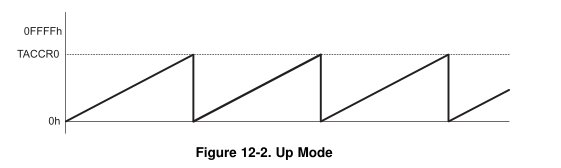
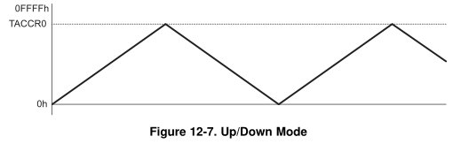

title = 'Timer A (Interval Timing). Lab 5 Intro'

# Lesson 28 Notes

## Readings
- [Family Users Guide](/datasheets) pp355-373 - Timer_A

## Assignment
- Lab 5 Prelab

## Lesson Outline
- Review Interrupts
- Timer_A
- Lab 5 Introduction

Lab 5 is next time!  You'll only get one in-class lesson to do it, so make sure you're comfortable with interrupts and Timer A before you get to the lab.  Ask me questions if you don't understand something!

## Review Interrupts

Cover material we couldn't get to last class.

Review GPIO interrupt example we covered at end of last class - maybe with detecting which button was pushed among multiple buttons connected to Port 1.

Ask questions...

Any questions?

## Timer_A

Timer A is a 16-bit timer / counter with multiple features.  Today, we'll talk a bit about how it works and how to use it to perform interval timing.  Say, for instance, your MSP430 was powering a weather station.  You want to get a temperature reading every 10 seconds.  With Timer A and interrupts, you could put your chip into a low power state, waking up periodically to take readings.  Cool!

### Block Diagram

Let's take a look at the Timer_A Block Diagram and learn a little about how it works.


Today we'll focus on the top block - the Timer Block.

Things to note:

- TASSELx bits
    - These select the clock signal Timer_A counts off of
    - In actuality, selects one of four inputs to a multiplexer
- IDx
    - Allows us to slow down this frequency by dividing it
    - Say we had a 1MHz clock source:
        - Divide by 2: 500kHz
        - Divide by 4: 250kHz
        - Divide by 8: 125 kHz
- TAR
    - This is is the register that holds the current count
    - Counts off of the clock source we selected
    - TACLR bit clears it
    - RC tells us when the timer rolls over - can trigger an interrupt!
- Count Mode
    - Specifies the way the timer counts (we'll cover later)

Note MUXs, AND gates, OR gates, flip flops.

### General Functionality

Go to Family Users Guide pp356.

**TACTL**


TAR increments or decrements (depending on mode) with each rising edge of the clock.

We can clear TAR by setting the TACLR bit.

It's recommended to stop the timer before modifying its operation to avoid weird operating conditions.

To stop the timer, we can set the mode control bits to `00`.

To start the timer, we can set it to one of three modes: up, continuous, and up / down.


**Timer Modes:**

Up Mode counts from 0 to the value in register TACCR0.  When it hits TACCR0, the CCIFG interrupt flag is set.  When it hits 0 (the next tick), the TAIFG interrupt flag is set.



Continuous mode counts from 0 to 0xffff.  When it hits 0, the TAIFG interrupt flag is set.


Up / down mode counts from 0 to the value in register TACCR0, then back down to 0.  When it hits TACCR0, the CCIFG interrupt flag is set.  When it hits 0, the TAIFG interrupt flag is set.



### Interval Timing - Flash LEDs

Let's use this to perform an action at a specified time interval.  Remember the programmer's job with respect to interrupts:

1. Initialize
    - Configure subsystem
        - Stop timer!
            - Set Mode Control to 00 in TACTL
        - Clear TAR
            - Set TACLR bit in TACTL
        - Set for continuous mode
            - Set Mode Control to 10 in TACTL
    - Clear interrupt flag
        - Clear TAIFG in TACTL
    - Turn on local switch
        - Set TAIE in TACTL
    - Turn on global switch
        - Set the GIE bit in the SR
2. Write ISR
    - Include `#pragma vector` statement and subroutine itself
        - `#pragma vector=TIMER1_A3` 
        - NOTE: This vector gets triggered by multiple causes!
            - In our case, we only enabled the TAIE interrupt so we know the cause
    - Clear interrupt flag
        - Clear TAIFG in TACTL
    - Accomplish task
        - Toggle LEDs!
3. Give interrupt opportunity to occur
    - It might take some time!

### Implementation of Flash LEDs

```
char flag = 0;                  // global variable to share info between main and ISR

int main(void)
{
    WDTCTL = WDTPW|WDTHOLD;     // stop the watchdog timer

    P1DIR |= BIT0|BIT6;         // set LEDs to output 

    TACTL &= ~(MC1|MC0);        // stop timer

    TACTL |= TACLR;             // clear TAR

    TACTL |= TASSEL1;           // configure for SMCLK

    TACTL |= ID1|ID0;           // divide clock by 8

    TACTL &= ~TAIFG;            // clear interrupt flag

    TACTL |= MC1;               // set count mode to continuous

    TACTL |= TAIE;              // enable interrupt

    __enable_interrupt();       // enable maskable interrupts

    int count = 0;

    while(1)
    {
        // do other useful stuff

        // respond to interrupt if it occurred
        // flag is global variable used to share information between main and the ISR
        if (flag)
        {
            flag = 0;
            P1OUT ^= BIT0;
            if (count)
            {
                P1OUT ^= BIT6;
                count = 0;
            } else
                count++;
        }
    }

    return 0;
}

// Keeps track of time asynchronously - cool!
// Flag for continuous counting is TAIFG
interrupt(TIMER0_A1_VECTOR) TIMER0_A1_ISR()
{
    TACTL &= ~TAIFG;            // clear interrupt flag
    flag = 1;
}
```

## Lab 5 Introduction

**TODO: Update writeup based on lab changes**

Let's take a look at Lab 5.

This won't be as hard as the last two labs - but you don't get as much time!  Only one in-class lesson, two out-of-class lessons.

The goal of this lab is to give you experience using interrupts.  You can't poll the buttons!  You must handle button pushes via interrupts.  You must use interrupts and Timer_A to keep track of the 2-second between-move time limit.

This lab always gives cadets problems with debouncing.  Think about this and do a good job - I won't sign off required functionality if I notice button bouncing or unresponsiveness.

A Functionality requires you to place the MSP430 in a low power mode.  We haven't talked about that yet.  You can reference the [Lesson 30 Notes](/notes/L30/) for more information or consult the [User's Guide](/datasheets/).
