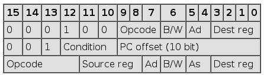

# Lesson 3 Notes

## Readings
Debuggers
[MSP430 Instruction Set](http://mspgcc.sourceforge.net/manual/x223.html)

## Lesson Outline
- MSP430 Execution Model
- MSP430 Instruction Set
- Converting Assembly to Machine Code

## MSP430 Execution Model
*[Move through introducing the program and disassembly quickly, was covered last lesson]*

Last time, we introduced the MSP430, talked a little about its architecture, and we wrote and ran our first program.

Can anyone tell me what the process is to convert an assembly language program to an executable that we can load onto our chip?

**Assembly Language Program --> Assembler --> Relocatable Object Code --> Linker --> Executable Binary**

*[Touch on what each stage in the process does]*

Be familiar with this process - we'll be using it and building on it for the remainder of the course.  And it's the way computer programs on every computer are run.

Ok, remember the program we ended last class period on.
```
; This program sets all pins on Port 1 to output and high.  Since LEDs 1 and 2 are connected to P1.0 and P1.6 respectively, they will light up.

.equ    WDTPW, 0x5a00
.equ    WDTHOLD, 0x0080
.equ    WDTCTL, 0x0120
.equ    P1DIR, 0x0022
.equ    P1OUT, 0x0021

.text
main:
    mov.w   #WDTPW, r15
    xor.w   #WDTHOLD, r15
    mov.w   r15, &WDTCTL
    bis.b   #0xFF, &P1DIR
    bis.b   #0xFF, &P1OUT
loop:
	jmp loop

.section ".vectors", "a"
    .org    0x1e
    .word   main
```
What was the role of the `.equ` statements?  What does the `.text` directive do?  Briefly walk through program again.  I'm pulling up a copy of the same program, but I've abstracted the `.equ` statements into a header file and used it using the `.include` directive.  *[Bring it up in vim]*

Let's send it through our assembly process and load it onto our chip.  It works!  Just like last time.  But **how** does it work?  Let's learn about how the MSP430 executes the code we've given it.

I'll **disassemble** the executable to give us a better idea of where the linker wound up placing our instructions.  Remember, disassembly is the process of converting machine code into assembly language.  Is MSP430 big-endian or little-endian?  How can we tell?

```
Disassembly of section .text:

0000c000 <__ctors_end>:
    c000:	3f 40 00 5a 	mov	#23040,	r15	;#0x5a00
    c004:	3f e0 80 00 	xor	#128,	r15	;#0x0080
    c008:	82 4f 20 01 	mov	r15,	&0x0120	
    c00c:	f2 d3 22 00 	bis.b	#-1,	&0x0022	;r3 As==11
    c010:	f2 d3 21 00 	bis.b	#-1,	&0x0021	;r3 As==11

0000c014 <loop>:
    c014:	ff 3f       	jmp	$+0      	;abs 0xc014
```
*[OK, can slow back down - this stuff is new]*

To analyze how this program works, I'm going to use a tool called a **debugger**.  It allows us to step through code gradually and monitor the impact of different instructions on the state of the chip.  The debugger I'll use is called **gdb** (GNU Debugger) and can be used to debug programs on just about any architecture there is - I've also used it to debug on my Raspberry Pi (ARM) and x86_64 computers.  Real programmers use it all the time.  There's also a debugger built into Code Composer.  This is an important tool you'll use a lot in analyzing the behavior of your program when you encounter errors.

*[Open up gdb side-by-side with disassembled code]*

Looking at our disassembled program, at what address does our program begin?  0xc000.  Think back to the registers we described yesterday.  Does anyone remember what the program counter does?  It holds the address of the instruction that's about to be executed!  Don't worry about anything else for now - we'll learn about the other special purpose registers later.

View registers - $pc holds 0xc000!  What's this instruction do?  What's the address of our next instruction?  So what would we expect $r15 and $pc to hold once we execute it?  $pc = 0xc004, $r15 = 0x5a00.  Step.

*[Go through instruction by instruction until it's clear everyone gets it]*

**Execution Time**  
The time it takes to execute an instruction varies based on the clock speed of the CPU and the number of cycles a given instruction takes to execute.  The msp430g2553 has a clock that defaults to around 1.1MHz, but can be configured to run at up to 16MHz.  We'll talk about this more further along in the semester.

Debuggers are a tool we'll use a lot.  Here's some more cool features that will help you get to the bottom of problems:

- Set breakpoints to stop execution at points of interest.
- Print items of interest after each step.
- Examine memory directly

## MSP430 Instruction Set

As I said last lesson, the MSP430 has only 27 native instructions.  There are three instruction formats - one operand, relative jumps, and two operand.  These tables are all taken from [MSP430 Instruction Set](http://mspgcc.sourceforge.net/manual/x223.html). 

Anyone remember the standard word / datapath size for the MSP430?  16 bits.  All instructions are 16 bits long.  Their binary format looks like this:



If instructions can be both word or byte instructions, they're word by default.  You can specify byte by appending .B to the instruction.  You can also explicitly add .W for word, but that's unnecessary.

We'll go through these in a lot more detail as the semester goes on - so I don't expect you to know all of them right now.

### One Operand Instructions

| Opcode | Assembly Instruction | Description |
| :---: | :---: | :---: |
| 000 | RRC(.B) |  9-bit rotate right through carry. C->msbit->...->lsbit->C. Clear the carry bit beforehand to do a logical right shift. |
| 001 | SWPB | Swap 8-bit register halves.  No byte form. |
| 010 | RRA(.B) | Badly named, this is an arithmetic right shift - meaning the most significant bit is preserved. |
| 011 | SXT | Sign extend 8 bits to 16.  No byte form. |
| 100 | PUSH(.B) |  Push operand on stack. Push byte decrements SP by 2. Most significant byte not overwritten.  CPU BUG: PUSH #4 and PUSH #8 do not work when the short encoding using @r2 and @r2+ is used. The workaround, to use a 16-bit immediate, is trivial, so TI do not plan to fix this bug. |
| 101 | CALL |  Fetch operand, push PC, then assign operand value to PC. Note the immediate form is the most commonly used. There is no easy way to perform a PC-relative call; the PC-relative addressing mode fetches a word and uses it as an absolute address. This has no byte form. |
| 110 | RETI | Pop SP, then pop PC. Note that because flags like CPUOFF are in the stored status register, the CPU will normally return to the low-power mode it was previously in. This can be changed by adjusting the SR value stored on the stack before invoking RETI (see below). The operand field is unused. |
| 111 | Unused | |

These are of the format `RRA    r10`.

### Relative Jumps

These are all PC-relative jumps, adding twice the sign-extended offset to the PC, for a jump range of -1024 to +1022.

| Condition Code | Assembly Instruction | Description |
| :---: | :---: | :---: |
| 000 | JNE/JNZ | Jump if Z==0 (if `!=`) |
| 001 | JEQ/Z | Jump if Z==1 (if `==`) |
| 010 | JNC/JLO | Jump if C==0 (if unsigned `<`) |
| 011 | JC/JHS | Jump if C==1 (if unsigned `>`) |
| 100 | JN | Jump if N==1 - Note there is no jump if N==0 |
| 101 | JGE | Jump if N==V (if signed `>=`) |
| 110 | JL | Jump if N!=V (if signed `<`) |
| 111 | JMP | Jump unconditionally |

These are of the format `JMP    loop`.

### Two Operand Instructions

There are generally of the form `dest = src OP dest`.  Operands are written in the order src, dest (AT&T syntax).

| Opcode | Assembly Instruction | Description | Notes |
| :---: | :---: | :---: |
| 0100 | MOV src, dest | dest = src | The status flags are NOT set. |
| 0101 | ADD src, dest | dest += src | |
| 0110 | ADDC src, dest | dest += src + C | |
| 0111 | SUBC src, dest | dest += ~src + C | |
| 1001 | SUB src, dest | dest -= src | Implemented as dest += ~src + 1 |
| 1001 | CMP src, dest | dest - src | Sets status only; the destination is not written. |
| 1010 | DADD src, dest | dest += src + C, BCD (Binary Coded Decimal) | Sets status only; the destination is not written. |
| 1011 | BIT src, dest | dest & src | Sets status only; the destination is not written. |
| 1100 | BIC src, dest | dest &= ~src | The status flags are NOT set. |
| 1101 | BIS src, dest | dest |= src | The status flags are NOT set. |
| 1110 | XOR src, dest | dest ^= src | |
| 1111 | AND src, dest | dest &= src | |

These are of the format `ADD r9, r10`.

### Emulated Instructions

There are a number of instructions that will be understood by the assembler that aren't native to the instruction set.  These are known as 'emulated' instructions.  They are actually implemented using one of the core instructions.

| Emulated Instruction | Assembly Instruction | Notes |
| :---: | :---: | :---: |
| NOP | MOV r3, r3 | Any register from r3 to r15 would do the same thing. |
| POP dst | MOV @SP+, dst | |

There are other ways to make NOPs - instructions that don't do anything - taking different numbers of cycles.  These can be useful in timing.

Branch and return can be done by adjusting the PC.

| Emulated Instruction | Assembly Instruction |
| :---: | :---: | :---: |
| BR dst | MOV dst, PC |
| RET | MOV @SP+, PC |

These instructions are useful for manipulating the status register.

| Emulated Instruction | Assembly Instruction |
| :---: | :---: | :---: |
| CLRC | BIC #1, SR |
| SETC | BIS #1, SR |
| CLRZ | BIC #2, SR |
| SETZ | BIS #2, SR |
| CLRN | BIC #4, SR |
| SETN | BIS #4, SR |
| DINT | BIC #8, SR |
| EINT | BIS #8, SR |

Shift / rotate left are emulated with ADD.

| Emulated Instruction | Assembly Instruction |
| :---: | :---: | :---: |
| RLA(.B) | ADD(.B) dst, dst |
| RLC(.B) | ADDC(.B) dst, dst |

Some common one-operand instructions:

| Emulated Instruction | Assembly Instruction |
| :---: | :---: | :---: |
| INV(.B) dst | XOR(.B) #-1, dst |
| CLR(.B) dst | MOV(.B) #0, dst |
| TST(.B) dst | CMP(.B) #0, dst |

Increment / decrement:

| Emulated Instruction | Assembly Instruction |
| :---: | :---: | :---: |
| DEC(.B) dst | SUB(.B) #1, dst |
| DECD(.B) dst | SUB(.B) #2, dst |
| INC(.B) dst | ADD(.B) #1, dst |
| INCD(.B) dst | ADD(.B) #2, dst |

Adding / subtracting using only the carray bit:

| Emulated Instruction | Assembly Instruction |
| :---: | :---: | :---: |
| ADC(.B) dst | ADDC(.B) #0, dst |
| DADC(.B) dst | DADDC(.B) #0, dst |
| SBC(.B) dst | SUBC(.B) #0, dst |

Here's a sample program using some of these instructions.  Let's walk through it using our **debugger**.
```
.include "header.s"

.text
main:
    ;disable watchdog timer
    mov     #WDTPW, r10
    xor     #WDTHOLD, r10
    mov     r10, &WDTCTL
    ;initialize stack
    mov     #RAMEND, r1

    ;code
repeat:
    mov.b     #0x75, r10
    add.b     #0xC7, r10
    ;result should be 0x13c, so we should see 3c in r10 and carry bit set
    adc     r10
    ;since carry bit was set, this should increment r10 to 3d
    inv.b     r10
    ;invert, so r10 should be c2
    mov.w   #0x00aa, r10
    sxt     r10
    ;sign extend should clear upper 8 bits
    inv     r10 
    swpb    r10
    mov.w   r10, r9

    jmp     repeat

.section    ".vectors", "a"
.org    0x1e
    .word   main
```

Disassembled:
```
c010:	7a 40 75 00 	mov.b	#117,	r10	;#0x0075
c014:	7a 50 c7 00 	add.b	#199,	r10	;#0x00c7
c018:	0a 63       	adc	r10		
c01a:	7a e3       	xor.b	#-1,	r10	;r3 As==11
c01c:	3a 40 aa 00 	mov	#170,	r10	;#0x00aa
c020:	8a 11       	sxt	r10		
c022:	3a e3       	inv	r10		
c024:	8a 10       	swpb	r10		
c026:	09 4a       	mov	r10,	r9	
c028:	f3 3f       	jmp	$-24     	;abs 0xc010
```

## Converting Assembly to Machine Code

*[This can spill over into the next lesson if necessary]*

How can we be sure that the assembler is doing its job?  How can we know that it is producing the proper machine code for the instructions we've given it?  The table I showed initially gives us the tools to manually convert assembly to machine code as well as the reverse

Our three types of instructions and their binary breakdown:


Addressing modes cover how our instructions reference their operands - the pieces of information they need to do their job.  Our available addressing modes (we'll learn more about this next time) and their binary breakdown:

| Code | Addressing Mode | Description |
| :-: | :-: | :-: |
| 00 |  Rn	| Register direct |
| 01 |  offset(Rn)	| Register indexed |
| 10 |  @Rn	| Register indirect |
| 11 |  @Rn+	| Register indirect with post-increment |

Let's try a couple to get us familiar with the process.

First, let's convert a single-operand instruction - `SXT r10` - from our disassembly, `c020:	8a 11       	sxt	r10`

The first six bits are always `000100`.  Next comes the opcode, which we'll look up - it's `011`.  Since this is a word instruction, B/W will be `0` - byte would be 1.  We'll learn about addressing modes tomorrow, but the addressing mode we use here is called Register Direct because we're referencing the value contained in a register and is coded by `00`.  Finally, we have to specify our destination register r10 - what's the binary for 10?  `1010`.  So our hand-assembled machine code instruction is `0001 0001 1000 1010` or `8a 11` in little-endian hex.

Let's try a relative jump instruction - `JMP $-24` - from our disassembly, `c028:	f3 3f       	jmp	$-24     	;abs 0xc010`.   This instruction jumps back to the start of our code - -24 from 0xc028.

The first 3 bits will always be `001`.  Next, we'll find the condition code - `111`.  Finally, we need to calculate the PC offset - -26 in our case, since the PC increments immediately when we execute an instruction.  Remember, we're jumping 2x the sign-extended offset.  So our jump is going to be -13 or `1111110011`.  So our hand-assembled machine code instruction is `0011 1111 1111 0011` or `f3 3f` in little-endian hex.

Let's try a two-operand instruction - `mov r10, r9` - from our disassembly, `c026:	09 4a       	mov	r10,	r9`.

The first 4 bits are the opcode, which we'll look up - it's `0100`.  Next, we need to indicate the source register - r10, which is `1010` in binary.  Next, we need to know the addressing mode of the destination.  It's Register Direct - `0`, it only needs a single bit because there are only two ways the destination can be addressed.  Next, we need to know if it's a byte or word instruction.  It's a word, so `0`.  Finally, source addressing mode - also Register Direct, so `00`.  Finally, we need the destination register, r9 - `1001`.  So our hand-assembled machine code instruction is `0100 1010 0000 1001` or `09 4a` in little-endian hex.

**Tough One!** - this introduces some addressing concepts, which we'll discuss next lesson.  Potentially a teaser.

Let's try another two-operand instruction - `add.b #0xC7, r10` - from our disassembly, `c014:	7a 50 c7 00 	add.b	#199,	r10	;#0x00c7`.

The first 4 bits are the opcode, which we'll look up - it's `0101`.  Next, we need to indicate the source register.  Since we're using an immediate, we'll look at the word following our instruction - the instruction pointed to by the PC  - so the source is the PC `0000`.  Next, we need to know the addressing mode of the destination.  It's Register Direct - `0`, it only needs a single bit because there are only two ways the destination can be addressed.  Next, we need to know if it's a byte or word instruction.  It's a byte, so `1`.  Finally, source addressing mode - PC indirect , so Register Indirect with a post increment - `11`.  Finally, we need the destination register, r10 - `1010`.  So our hand-assembled machine code instruction is `0101 0000 0111 1010` or `7a 50` in little-endian hex.

Easy enough?!
