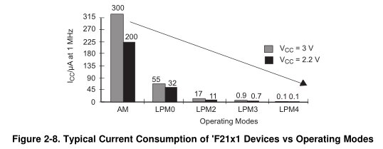
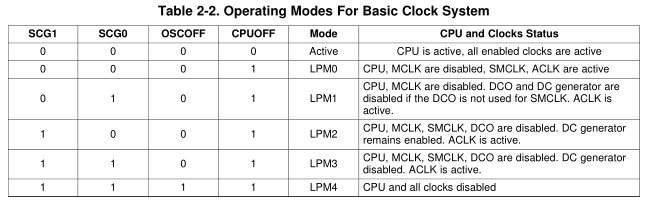

title = 'More Advanced git.  Low Power Modes.  GR Review.'

# Lesson 30 Notes

## Readings
- [Low Power Operation - Family Users Guide pp38-41](/datasheets/msp430_msp430x2xx_family_users_guide.pdf)

## Assignment
- Lab 5 Functionality (COB L30)
- Lab 5 Notebook (COB L31)

## Lesson Outline
- More Advanced git
- Low Power Modes
- GR Review

**Reminder:** Lab 5 functionality is due by COB today!  Lab 5 documentation is due by COB next time!

Just a few topics today - let's get through this material quickly so we can use the rest of the time to work on the lab.

## More Advanced git

We've been using git for an assignment and two labs now.  To this point, we've mostly been using it to log our progress via commits and have the ability to rollback files to previously committed versions.  But it can do a lot more - and I want to show you some of that today.

### Review

First, some review:

- How do we create a new repo?
	- `git init`
- How do we add files to version control?
	- `git add`
- How do we commit files?
	- `git commit -m "my great changes"`
	- Remember, you have to add the files you want to commit each time!
		- Shortcut to commit all files under revision control: `git commit -am "my changes"`
- How do we view our commit history?
	- `git log`
- How do we push our changes up to Github?
	- `git push origin master`

*[Demo commands as you go]*

Questions about this stuff?

Questions about command line in general?  Any particularly annoying things?

### Fetching Latest Library Changes

Say we want to use someone else's code, how do we do that?

- Note the URL of the repo we want to clone
- Navigate to the directory for our project
- `git clone https://github.com/toddbranch/my_sweet_repo`
- Whereever you want to use it, `#include "my_sweet_repo.h"`
- Since it's under version control under its own repo, we probably want to add `my_sweet_repo/` to our `.gitignore` file
	- What does this do?

Say the maintainer has made a change to the repo that we want reflected in our local copy:

- `git pull origin master`
	- This will pull down the most recent changes to our repo, assuming we haven't made any commits that put us ahead of the remote branch

*[Demo commands as you go]*

In the previous command, what's `origin`?  What's `master`?

### Maintain Multiple Code Versions

It's common for programmers to need to maintain multiple versions of code simultaneously.  Imagine you've released all planned features for v1 of your code.  You want to move onto v2, but the move to a different major version number means you'll break compatability with previous versions.  You know some people want to stick with v1 and not transition their code.  While you're developing v2, a major security bug is exposed in v1.  You need to fix this bug for the people still using it!

With **branches**, we can maintain v1 and v2 side-by-side in the same repository and switch between the two easily.

When we want to move onto a different version of code, we can create a new branch and begin committing to it.  If we want to make modifications to the other version, we can switch branches.

*[Draw picture of branching v1 to v2, then pushing security patch to v1]*

This could be useful if you want to maintain multiple versions for Required, B, and A functionality or different strategies for navigating the robot maze.

- When you initially commit code, you're using the `master` branch
- To see the branches in your repo, type `git branch`
	- The branch with the `*` next to it as the currently active branch
- To create a new branch, type `git branch myBranchName`
	- This creates a new branch called `myBranchName` in your repo
	- Type `git branch` to verify 
- To switch to this new branch, type `git checkout myBranchName`
	- Type `git branch` to verify the `*` has switched to `myBranchName`
- Now, we can make commits to either branch that won't be reflected in the other.

Sometimes, I'll make a branch to begin work on a feature and then `merge` that branch with `master` once the feature is complete.

- To merge, simply switch to the branch you want to merge into and type `git merge otherBranchName`
	- The changes from your other branch will be reflected
	- If there are conflicts between the two branches, you may have to resolve them manually

*[Demo commands as you go]*

### File Operations

- You may have noticed that there are some command line commands that don't work well with git, like `rm` and `mv`.  git provides replacements:
	- `git rm`
		- Removes files
	- `git mv`
		- Moves / renames files

*[Demo commands as you go]*

## Low Power Modes

The MSP430 is designed for ultralow-power applications.  It has five low power operating modes, known by the designators LPM0, LPM1, LPM2, LPM3, and LPM4.  These can disable various system components depending on application needs.



These modes are configured using bits in the Status Register (SR) - namely CPUOFF, OSCOFF, SCG0, and SCG1.  The benefit of including these in the SR is that they are saved when an ISR is triggered and restored afterwards!

What happens to the bits of the SR once the ISR is triggered?  They're cleared - so the MSP430 can 'wake up' from a low-power mode.

| 15 | 14 | 13 | 12 | 11 | 10 | 9 | 8 | 7 | 6 | 5 | 4 | 3 | 2 | 1 | 0 |
| :-: | :-: | :-: | :-: | :-: | :-: | :-: | :-: | :-: | :-: | :-: | :-: | :-: | :-: | :-: | :-: |
| Reserved	colspan=7 | V | SCG1 | SCG0 | OSCOFF | CPUOFF | GIE | N | Z | C |

Here are the subsystems that are disabled based on each Low Power Mode:



If a peripheral depends on a clock that is disabled, it is disabled until the clock becomes active.

Manufacturers recommend maximizing time in LPM3 and using the ACLK to for peripherals.

Your header file provides some macros for entering / exiting these modes:
```c
// from msp430g2553.h

#define LPM0      _BIS_SR(LPM0_bits)     /* Enter Low Power Mode 0 */
#define LPM0_EXIT _BIC_SR_IRQ(LPM0_bits) /* Exit Low Power Mode 0 */
#define LPM1      _BIS_SR(LPM1_bits)     /* Enter Low Power Mode 1 */
#define LPM1_EXIT _BIC_SR_IRQ(LPM1_bits) /* Exit Low Power Mode 1 */
#define LPM2      _BIS_SR(LPM2_bits)     /* Enter Low Power Mode 2 */
#define LPM2_EXIT _BIC_SR_IRQ(LPM2_bits) /* Exit Low Power Mode 2 */
#define LPM3      _BIS_SR(LPM3_bits)     /* Enter Low Power Mode 3 */
#define LPM3_EXIT _BIC_SR_IRQ(LPM3_bits) /* Exit Low Power Mode 3 */
#define LPM4      _BIS_SR(LPM4_bits)     /* Enter Low Power Mode 4 */
#define LPM4_EXIT _BIC_SR_IRQ(LPM4_bits) /* Exit Low Power Mode 4 */
```

I will not test you on this material - I just think it's important to know given that I've been talking about the low-power capabilities of the MSP430 all semester.

More detailed info is in the reading from today.

## GR Review

This is the GR - similar layout to the last one.  5 questions.  The first is kind of a hodge podge of short questions, the rest are work out.  I've made a conscious effort to make this shorter than the last one, so you shouldn't be crunched for time.

The resources I'll give you are also available on the course website at [GR 2 Resources]().

From the first GR, you should notice that I place an emphasis on practical skills.  So expect to write code!

You can also expect the breakdown of the GR to reflect the relative amount of time we've spent on each of the topics.  So focus on the major topics covered in the lessons and labs!

Any questions about the GR?

**You can use any remaining class time to continue working on Lab 5.**
