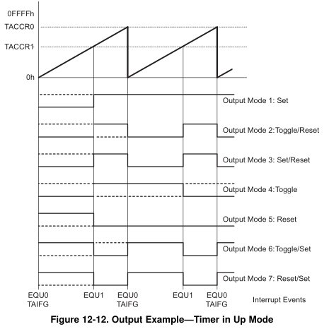

title = 'Timer_A: Capture / Compare, Pulse Width Modulation.  Lab 6 Introduction.'

# Lesson 31 Notes

## Readings
- [Intro to Pulse Width Modulation](http://www.embedded.com/electronics-blogs/beginner-s-corner/4023833/Introduction-to-Pulse-Width-Modulation)
- [MSP430: Timers and Clocks and PWM!  Oh My!](http://www.msp430launchpad.com/2010/07/timers-and-clocks-and-pwm-oh-my.html)

## Assignment
- Lab 6 Prelab

## Lesson Outline
- Admin
- Lab 6 Introduction
- Pulse Width Modulation
- Capture / Compare
- Example
- Lab 6 Tips

## Admin

- Video
- One day extension on Lab 5 functionality
- Documentation / notebooks (to get functionality checkoffs) due COB today
- GR next time
	- Any questions about the GR?
	- Go over Lab 5 interrupt code once more
		- Have received a bunch of questions on it, which makes me think many people don't understand
- L33 we start on the robot!

## Lab 6 Introduction

Next lesson, you're going to start work on the robot.  Eventually, you'll use the MSP430 to power it to navigate a maze.  But first, we have to learn how to use the onboard motors to move our robot forward, back, left and right - that's the crux of Lab 6.

How do you move a DC motor?  You apply an analog voltage!

*[Demo motor with power supply]*

But how can we do this with the MSP430?  GPIO only gives us logical 1 or 0.  We don't have an onboard Analog-to-Digital converter.  Say we want to generate an analog output using our MSP430 - how would we do it?  The technique we'll learn today and use in Lab 6 is called Pulse Width Modulation.

## Pulse Width Modulation

Imagine a lightbulb that is on 50% of the time and off 50% of the time.  *[Draw waveform with 50% duty cycle on the board]*.

*[Turn classroom lights on and off]*

If the frequency of the change is very slow, it would be very noticable that we're just switching between two digital states.

But what if the frequency was very fast?  It would just appear as a light with 50% brightness!  It would appear like an analog voltage of 50% of the high voltage, providing 50% power.

To change the brightness of the bulb, we can change the percentage of the period the signal is high!  Assuming our logic high is 5V.  If our signal was high 10% of the time, it would look like a 0.5V analog signal.  50% of the time would look like a 2.5V analog signal.  100% of the time would look like the full 5V analog signal.

We call the percentage of a period the signal is high the signal's **duty cycle**.

Here's a demo of me switching between different duty cycles to power an LED:

*[LED with PWM demo]*

See how the brightness of the LED varies?

Let's see how it looks on the multimeter!

*[Hook up to DMM]*

See how the voltage changes, but reaches a steady analog state each time?

Let's see how it looks on a scope.

*[Hook up to O-Scope]*

See how it's actually just a recurring signal with a specified percentage high?  See how the percentage of time it's high controls the voltage?  Sweet!

### Terminology

- Period
	- Time interval over which a clock repeats itself
- Duty Cycle
	- Percentage of time a clock signal is logic high

## Capture / Compare

Ok, back to the technical stuff.

In addition to what we talked about last time, Timer_A comes equipped with three Capture/Compare blocks.

Back to our trusty block diagram.  Today we'll be looking at the bottom:


**Capture:** Monitor a pin for a specified signal (rising edge, falling edge, either edge) and record when it occurs.

**Compare:** Generate a specified signal with precise timing.

Here's how those registers are configured:


### Capture

Capture mode is selected when the CAP bit in TACCTL is set to 1.  It's used to record time events.  It can be used for:

- Event detection
- Event counting
- Pulse-width measurement
- Frequency measurement

Each TACCRx has two possible capture pins - CCIxA and CCIxB.  The one being monitored is selectable by software.

If a capture occurs:
	- The TAR value is copied into the TACCRx register
	- THe interrupt flag CCIFG is set


### Compare

Compare mode is selected when the CAP bit in TACCTL is set to 0 (it's 0 by default).

Remember the different Timer_A counting modes from last lesson?


In the lab, we only used Continuous.  But what does Up Mode do?


It counts from 0 up to the value in TACCR0!  We can set the value in TACCR0 just by writing to it.

TimerA0 also comes equipped with two more Capture / Compare registers - TA0CCR1 and TACCR2.  We can set their values by writing to them as well.  These gives us interesting capabilities.  While TimerA0 counts upward, these registers can perform actions when the values in them are passed.  Here's what they can do:


That might be confusing.  Check out that example:



## Example Code

This is the code I used to light the LED at four different levels of brightness:

```
#include <msp430.h>

int main(void)
{
    WDTCTL = WDTPW|WDTHOLD;                 // stop the watchdog timer

	P1DIR |= BIT2;				// TA0CCR1 on P1.2
	P1SEL |= BIT2;				// TA0CCR1 on P1.2

	TACTL &= ~MC1|MC0;			// stop timer A0

    TACTL |= TACLR;				// clear timer A0

    TACTL |= TASSEL1;           // configure for SMCLK

	TACCR0 = 100;				// set signal period to 100 clock cycles (~100 microseconds)
	TACCR1 = 25;				// set duty cycle to 25/100 (25%)

	TACCTL1 |= OUTMOD_7;		// set TACCTL1 to Reset / Set mode

    TACTL |= MC0;				// count up

	while (1) {
		__delay_cycles(1000000);
		TACCR1 = 50;			// set duty cycle to 50/100 (50%)
		__delay_cycles(1000000);
		TACCR1 = 75;			// set duty cycle to 75/100 (75%)
		__delay_cycles(1000000);
		TACCR1 = 100;			// set duty cycle to 100/100 (100%)
		__delay_cycles(1000000);
		TACCR1 = 25;			// set duty cycle to 25/100 (25%)
	}

    return 0;
}
```

## Lab 6 Tips

### Motor Driver Chip

You cannot hook your MSP430 directly up to the motors - it can supply enough current!  We need to use a motor driver chip instead.  It can only supply 1A per circuit!  Do not exceed that!  [Check out the datasheet for wiring details.](/datasheets/)

### Motor Stall Current

This is the max current draw your motor might have - usually happens when it runs up against the wall or something.  This better not exceed the 1A your motor driver chip can supply or you'll burn it!

*[Show technique to measure stall current]*

On my robot, the stall current does not go below one amp until my motor is being driven at 8V or less - roughly 60% duty cycle.  Exceed this at your own risk!

### MSP430 In-Circuit

**Supplying Power**

We have 3.3V regulators!  Use them!  If you try to give 5V to your MSP430, you will fry it!  [Check out the datasheet for wiring details.](/datasheets/)

**Programming**

[See the tutorial on the website!]()  You can just jump the VCC / TEST / RESET signal over to the chip on the breadboard.

### Chip Reset Due to Current Fluctuation

If the motors draw a large amount of current (due to stall), there is a good chance it will interfere with the current provided to your MSP430.  To combat this, you can put a large capacitor across the 5V rail (between power and ground).  This will supplement the lost current and prevent your chip from being reset.
