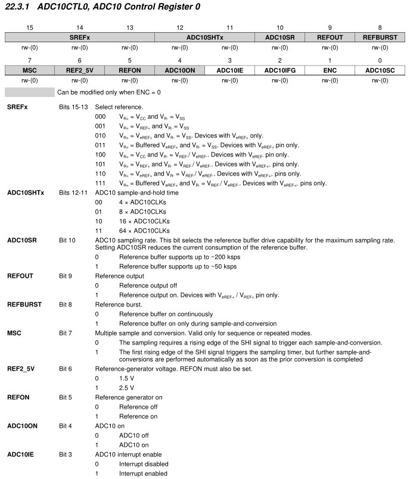
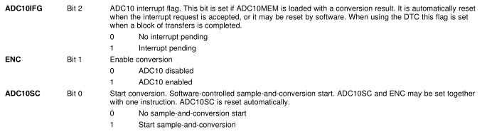
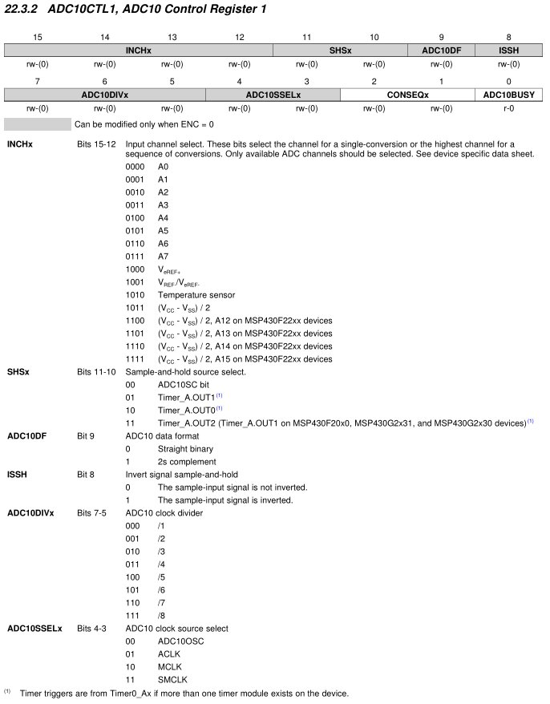
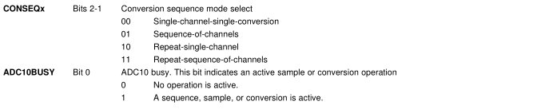
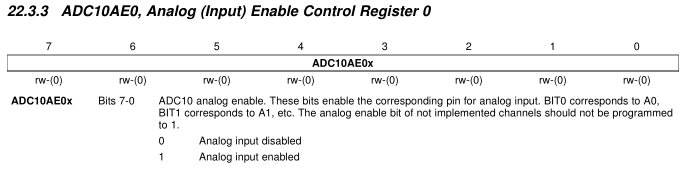
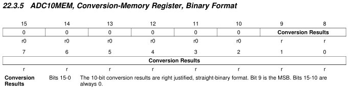

title = 'Analog-to-Digital and Digital-to-Analog Conversion. Lab 7 / 8 Intro.'

# Lesson 36 Notes

## Assignment
- Lab 7 Prelab

## Lesson Outline
- Robot Demo
- ADC Example Code
- The MSP430's ADC10
- Analog-to-Digital Conversion
- Digital-to-Analog Conversion
- Lab 7 / 8 Introduction

## Admin

This is our last in-class lesson of the year!  I'm going to experiment with a new approach today where I kind of start at the end and work backward - let me know what you think!

## Robot Demo

Your robot has three sets of sensors that you'll use to navigate the maze.  They're on the front, left, and right. *[Show on robot]*

Each has an IR emitter and IR sensor.  The idea is that the closer the wall gets, the more radiation from the emitter will be reflected off the wall and into the sensor.  The amount of radiation detected is proportional to the amount of voltage the sensor emits.

So voltage will increase as the wall gets closer and decrease as it gets farther away.

You get access to these readings via pins on your robot.

*[Demo with multimeter and moving toward and away from the center sensor]*

See how the voltage changes?

Another important thing to note - the reflectivity of the surface the radiation is bouncing off of matters **a lot** for how much will be picked up by the emitter

*[Demo with black box in front of sensor, then with white paper]*

In Lab 7, you'll have to use Analog-to-Digital conversion to take these readings into your chip.  Then, you'll have to take measurements throughout the maze so you know the distance from the wall that different voltages mean.

## ADC Example Code

Let's take the first sensor readings from our robot.  This code monitors A4, located on P1.4.  If the voltage on that pin is above the threshold 0x1FF, it sets P1.0 (an LED on the Launchpad).  Otherwise, it clears it.

Let's run the code!

*[Demo on robot - hook up DMM to measure voltage into A-to-D]*

```c
// TI example code

#include <msp430g2553.h>

int main(void)
{
  WDTCTL = WDTPW + WDTHOLD;                 // Stop WDT
  ADC10CTL0 = ADC10SHT_2 + ADC10ON + ADC10IE; // ADC10ON, interrupt enabled
  ADC10CTL1 = INCH_4;                       // input A1
  ADC10AE0 |= 0x08;                         // PA.1 ADC option select
  P1DIR |= 0x01;                            // Set P1.0 to output direction

  for (;;)
  {
    ADC10CTL0 |= ENC + ADC10SC;             // Sampling and conversion start
    __bis_SR_register(CPUOFF + GIE);        // LPM0, ADC10_ISR will force exit
    if (ADC10MEM < 0x1FF)
      P1OUT &= ~0x01;                       // Clear P1.0 LED off
    else
      P1OUT |= 0x01;                        // Set P1.0 LED on
  }

	return 0;
}

// ADC10 interrupt service routine
#pragma vector=ADC10_VECTOR
__interrupt void ADC10_ISR(void)
{
  __bic_SR_register_on_exit(CPUOFF);        // Clear CPUOFF bit from 0(SR)
}
```

So how does this work on the MSP430?

## The MSP430's ADC10

In the above code, we used the MSP430's ADC10 subsystem to take the readings - the 10 indicates the number of bits of resolution we have to represent each sample.


If we have 10 bits, what's the highest value our ADC can return?  0x3FF!

Let's walk through the code and see what each line is doing.

`ADC10CTL0 = ADC10SHT_2 + ADC10ON + ADC10IE; // ADC10ON, interrupt enabled`

So we're setting some bits in the ADC10CTL0 register - what are these bits doing?  Let's check out the register:












But how does the underlying technology work?

## Analog-to-Digital Conversion

If we have a 10 bit ADC, how many unique values can we represent?

Talk about the equation first.

- Generate a digital value that represents the input voltage "level"
- Levels usually range from (0 to 2^b) or (-2^(b-1) to 2^(b-1)-1)
- *Clipping* - above / below Vrh / Vrl voltages

### ATD Technologies

Talk about how it works.  On our chip, we have a Successive Approximation ADC.

## Lab 7 / 8 Introduction

How can we use what we just learned to determine how to set our Vref value?

We want our Vref to be as close as possible to the highest voltage we expect to convert.  You need to characterize your robot in the maze to determine this.

## Digital-to-Analog Conversion

Your chips do not have Digital-to-Analog hardware on board, but it's out there!
