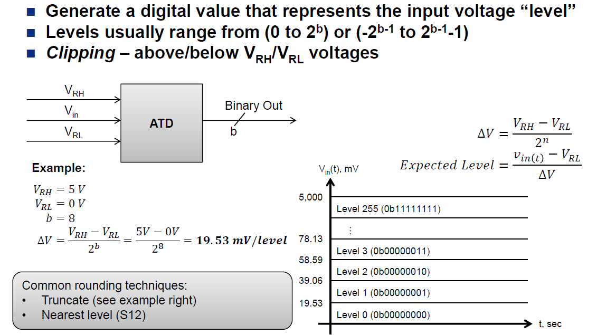
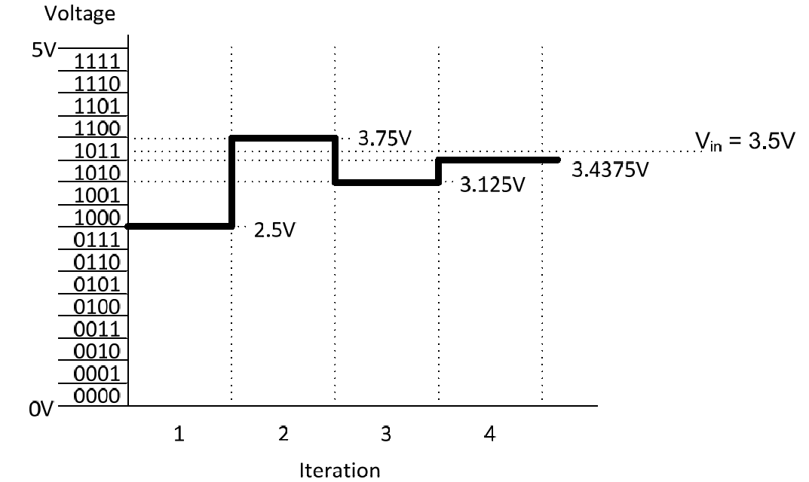
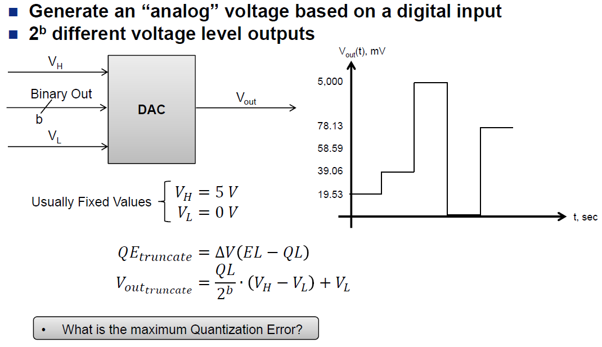

title = 'Analog-to-Digital and Digital-to-Analog Conversion. Lab 7 / 8 Intro.'

# Lesson 36 Notes

## Assignment
- Lab 7 Prelab

## Lesson Outline
- Admin
- Robot Demo
- ADC Example Code
- The MSP430's ADC10
- Analog-to-Digital Conversion
- Digital-to-Analog Conversion
- Lab 7 / 8 Introduction

## Admin

- Amazon Drone video!
  - http://www.youtube.com/watch?v=98BIu9dpwHU&feature=youtu.be
  - You better believe there are microcontrollers in that thing!
- Demo robot fix
  - I sent this e-mail on the Friday before break, but wanted to show you the fix in action
  - It turns out that the RESET line on the MSP430 is extremely sensitive to noise, which DC motors can create
  - To guard against the noise we can use a small (10pF) capacitor to smooth any voltage variation
  - Demo before fix, demo after fix
- Make up assignment
  - I'm offering an opportunity to do an assignment that will replace your lowest score
  - Send me 1 pull request on Github for the course website or file three issue reports for the course website
  - They must be meaningful, not necessarily specific

This is our last in-class lesson of the year!  I'm going to experiment with a new approach today where I kind of start at the end and work backward - let me know what you think!

From here on out, we're working toward getting you through the maze.  This lesson will show you how to use the robot sensors to detect walls and move your robot accordingly.

## Robot Demo

Your robot has three sets of sensors that you'll use to navigate the maze.  They're on the front, left, and right. *[Show on robot]*

Each has an IR emitter and IR sensor.  The idea is that the closer the wall gets, the more radiation from the emitter will be reflected off the wall and into the sensor.  The amount of radiation detected is proportional to the amount of voltage the sensor emits.

So voltage will increase as the wall gets closer and decrease as it gets farther away.

You get access to these readings via pins on your robot.

*[Demo with multimeter and moving toward and away from the center sensor]*

See how the voltage changes?

Another important thing to note - the reflectivity of the surface the radiation is bouncing off of matters **a lot** for how much will be picked up by the emitter

*[Demo with black box in front of sensor, then with white paper]*

In Lab 7, you'll have to use Analog-to-Digital conversion to take these readings into your chip.  Then, you'll have to take measurements throughout the maze so you know the distance from the wall that different voltages mean.

## ADC Example Code

Let's take the first sensor readings from our robot.  This code monitors A4, located on P1.4.  If the voltage on that pin is above the threshold 0x1FF, it sets P1.0 (an LED on the Launchpad).  Otherwise, it clears it.

Let's run the code!  Later I'll go through it line-by-line.

*[Demo on robot - hook up DMM to measure voltage into A-to-D]*

```c
// TI example code

#include <msp430g2553.h>

int main(void)
{
  WDTCTL = WDTPW + WDTHOLD;                 // Stop WDT
  ADC10CTL0 = ADC10SHT_3 + ADC10ON + ADC10IE; // ADC10ON, interrupt enabled
  ADC10CTL1 = INCH_4;                       // input A4
  ADC10AE0 |= BIT4;                         // PA.1 ADC option select
  ADC10CTL1 |= ADC10SSEL1|ADC10SSEL0;				// Select SMCLK
  P1DIR |= 0x01;                            // Set P1.0 to output direction

  for (;;)
  {
    ADC10CTL0 |= ENC + ADC10SC;             // Sampling and conversion start
    __bis_SR_register(CPUOFF + GIE);        // LPM0, ADC10_ISR will force exit
    if (ADC10MEM < 0x1FF)
      P1OUT &= ~0x01;                       // Clear P1.0 LED off
    else
      P1OUT |= 0x01;                        // Set P1.0 LED on
  }

	return 0;
}

// ADC10 interrupt service routine
#pragma vector=ADC10_VECTOR
__interrupt void ADC10_ISR(void)
{
  __bic_SR_register_on_exit(CPUOFF);        // Clear CPUOFF bit from 0(SR)
}
```

So how does this work on the MSP430?

## The MSP430's ADC10

In the above code, we used the MSP430's ADC10 subsystem to take the readings - the 10 indicates the number of bits of resolution we have to represent each sample.

If we have 10 bits, what's the highest value our ADC can return?  0x3FF!

Let's walk through the code and see what each line is doing.

`ADC10CTL0 = ADC10SHT_3 + ADC10ON + ADC10IE; // ADC10ON, interrupt enabled`

So we're setting some bits in the `ADC10CTL0` register - what are these bits doing?  Let's check out the register:


`ADC10CTL0 = ADC10SHT_3 + ADC10ON + ADC10IE; // ADC10ON, interrupt enabled`

`ADC10SHT_3` controls the amount of time per sample.  Section 22.2.5.1 of the Family Users Guide gives more information on this.  Essentially, the higher the input impedance seen by the chip, the longer you'll need to sample to get an accurate reading.  You can view the input pin as a low-pass filer.  On our robots, input impedance changes based on the amount of light reflected - it gets lower if more light is reflected.  There is **significant** loading at low voltages.  **My advice would be to choose the longest possible sampling period to be safe.**  This also means that your ADC will be more accurate at close distances.  You can tell you have loading if the voltage reading changes when you plug it into the chip.

`ADC10ON` turns the subsystem on.  `ADC10IE` enables the corresponding interrupt.

```c
  ADC10CTL1 = INCH_4;                       // input A4
  ADC10AE0 |= BIT4;                         // PA.1 ADC option select
  ADC10CTL1 |= ADC10SSEL1|ADC10SSEL0;       // Select SMCLK
  P1DIR |= 0x01;                            // Set P1.0 to output direction
```

So we're setting bits in the `ADC10CTL1` and `ADC10AE0` registers - let's take a look at those.


```c
  ADC10CTL1 = INCH_4;                       // input A4
  ADC10AE0 |= BIT4;                         // PA.1 ADC option select
  ADC10CTL1 |= ADC10SSEL1|ADC10SSEL0;       // Select SMCLK
  P1DIR |= 0x01;                            // Set P1.0 to output direction
```

`ADC10CTL1 = INCH_4;` selects the input channel to be A4.  There are many other options we can choose here, including an internal temperature sensor.

`ADC10AE0 |= BIT4;` this sets up A4 for analog input - disabling any internal chip components, etc. that could interfere. 

`ADC10CTL1 |= ADC10SSEL1|ADC10SSEL0;` selects the SMCLK to be our ADC clock source.  This runs at roughly 1MHz by default.  If we leave this unchanged, we'll use ADC10OSC as our clock source - which runs at roughly 5MHz.  This is also impacts our sample period - which is important depending on the impedance of our signal.  Remember the loading problems we talked about earlier?

`P1DIR |= 0x01;` just sets P1.0 to output so we can light up the LED on the Launchpad.

And now onto our `for` loop - that uses the ADC10MEM register:

```c
  for (;;)
  {
    ADC10CTL0 |= ENC + ADC10SC;             // Sampling and conversion start
    __bis_SR_register(CPUOFF + GIE);        // LPM0, ADC10_ISR will force exit
    if (ADC10MEM < 0x1FF)
      P1OUT &= ~0x01;                       // Clear P1.0 LED off
    else
      P1OUT |= 0x01;                        // Set P1.0 LED on
  }


// ADC10 interrupt service routine
#pragma vector=ADC10_VECTOR
__interrupt void ADC10_ISR(void)
{
  __bic_SR_register_on_exit(CPUOFF);        // Clear CPUOFF bit from 0(SR)
}
```


`for (;;)` is a forever loop - the same as `while (1)`.

`ADC10CTL0 |= ENC + ADC10SC;` - the ENC bit enables the core.  Control bits can only be modified when the core is disabled.  The ADC10SC bit tells the core to begin a sample-and-conversion sequence.

`__bis_SR_register(CPUOFF + GIE);` - here's some low-power code!  We're going to turn off the CPU and enable interrupts.

When the interrupt is triggered, we'll execute `__bic_SR_register_on_exit(CPUOFF);`, re-enabling the CPU and executing our next instructions.

Finally, we'll read the sample we took in via `if (ADC10MEM < 0x1FF)` - `ADC10MEM` is where our sample is stored. We'll use the reading to light the LED if it's above a threshold.

But how does the underlying technology work?

## Analog-to-Digital Conversion



Some questions:

- If we have a 10 bit ADC, how many unique values can we represent?
- What's better a smaller resolution or larger resolution?
- How can we improve resolution?  This is important on the robot - better resolution means you'll be able to see walls sooner.

### ATD Technologies

On our chip, we have a Successive Approximation ADC.



### Digital-to-Analog Conversion

Your chips do not have Digital-to-Analog hardware on board, but they're out there!



How would the robot motion lab have been easier if you had access to a DAC?

## Lab 7 / 8 Introduction

[Lab 7](/labs/lab7/index.html)

## End of Semster Talk

Congratulations on getting this far.  This class underwent a ton of changes this semester.  A lot of material we used to teach in ECE383 was moved into this course.  We also hit on a few topics we've never taught before.  Some of the material was brand new and untested.  The class got much harder than it had been in the past.  I know a lot of you were pushed to do things you weren't comfortable with.  I hope you can see the value in the skills you've learned.  I think you'll find them some of the most useful, practical things you'll learn.  I'm excited to see what you do with them in capstone and beyond.

General advice about living in the moment and not looking to future events to fix your problems.

http://www.thisamericanlife.org/radio-archives/episode/494/hit-the-road - 2030-2400

I'm going to send out an e-mail about course critiques - if you do them, I'll drop your lowest assignment.
