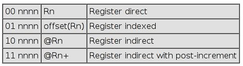

# Lesson 4 Notes

## Readings
Davies 5.2 (pp125 - pp131)  
[MSP430 Addressing Modes](http://mspgcc.sourceforge.net/manual/x147.html)

*Note*: Davies is great for walking through each addressing mode step-by-step and showing how it's relevant to higher-level programming.  MSP430 Addressing Modes addresses some of the nuances and conversion to machine code.

## Assignment
[Addressing Modes](/ECE382/assignments/L4_addressing_modes.html)

## Lesson Outline
- Addressing Modes
- Converting to Machine Code
- CompEx1 Intro

## Addressing Modes

Last lesson, we discussed the MSP430 instruction set and ended with converting a few instructions from assembly language to machine code.  We noticed that in order to convert from assembly language to machine code, you've got to have an excellent understanding of the instruction to include the **addressing modes** it uses to reference its operands.




Today, we're going to cover the full range of MSP430 addressing modes, practice some more conversion from assembly to machine code, and introduce you to your first computer exercise.

### Register Mode or Register Direct

This is the most straight-forward addressing mode - taking information directly from the CPUs registers.  If used in a one-operand instruction, the Ad value is `00`.  If used in a two operand instruction, Ad would be `0` because there are only two available addressing modes.  As would be `00`.

A few examples:
```
mov.w   r11,r10     ;move the word from r11 into r10 - both the source and destination addressing modes are register direct

bis.b   #0xFF, r6   ;set all the bits in r6.  in this instruction, only the destination addressing mode would be register direct 

inv.w   r5          ;remember, inv is an *emulated instruction* - it translates to xor #-1, r5 - only the destination addressing mode would be register direct

push    r9          ;push the value in r9 onto the stack

swpb    r10         ;swap the upper and lower byte of r10
```

### Indexed Mode

In this mode, your adding an offset to a given register to determine the actual address.

```
mov.w   3(r6), r5   ;this would move the word in the memory location at 3+r6 into r5
```

This mode is useful in indexing arrays.
```
int array[6] = {1,2,3,4,5,6};
array[0] = array[1];
```
Translates to:
```
mov.w   1(r6),0(r6) ;assuming r6 holds the first address of the array
```

In action:
```
int array[6] = {1,2,3,4,5,6};
array[0] = array[1];
```

Translates to:
```
0000c03e <main>:
    c03e:	04 41       	mov	r1,	r4	
    c040:	24 53       	incd	r4		
    c042:	31 50 f4 ff 	add	#-12,	r1	;#0xfff4
    c046:	94 43 f2 ff 	mov	#1,	-14(r4)	;r3 As==01, 0xfff2(r4)
    c04a:	a4 43 f4 ff 	mov	#2,	-12(r4)	;r3 As==10, 0xfff4(r4)
    c04e:	b4 40 03 00 	mov	#3,	-10(r4)	;#0x0003, 0xfff6(r4)
    c052:	f6 ff 
    c054:	a4 42 f8 ff 	mov	#4,	-8(r4)	;r2 As==10, 0xfff8(r4)
    c058:	b4 40 05 00 	mov	#5,	-6(r4)	;#0x0005, 0xfffa(r4)
    c05c:	fa ff 
    c05e:	b4 40 06 00 	mov	#6,	-4(r4)	;#0x0006, 0xfffc(r4)
    c062:	fc ff 
    c064:	1f 44 f4 ff 	mov	-12(r4),r15	;0xfff4(r4)
    c068:	84 4f f2 ff 	mov	r15,	-14(r4)	;0xfff2(r4)
    c06c:	31 50 0c 00 	add	#12,	r1	;#0x000c
```

#### PC Relative

```
mov.w   reset, r7
```

#### Absolute Mode

In this mode, you precede the location with an & to tell the assembler this is a literal location.

```
mov.w   0xff, &P1OUT
```

WARNING - potential pitfall:
```
mov.b   P1OUT,r7
```
Is not the same as:
```
mov.b   &P1OUT,r7
```
## More Conversion to Machine Code

What's the instruction size of the MSP430?  16 bits!  
Only takes a single clock cycle.

## CompEx1 Intro

