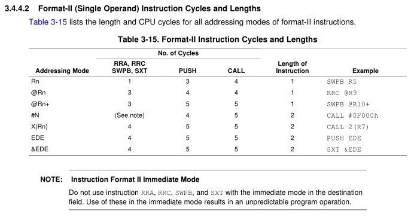
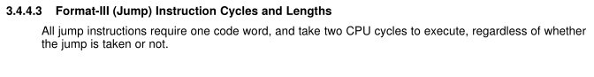

# Lesson 8 Notes


## Readings

- [Modularity](http://www.examiner.com/article/programming-concepts-the-benefits-of-modular-programming)
- [Skim the MSP430 Assembly Language Tools datasheet](/datasheets/msp430_assembly_language_tools.pdf)

## Assignment

- [Lab 1](/labs/lab1/index.html) Prelab

## Lesson Outline
- Instruction Execution Time
- More Assembly Process
- Assembler Directives
- Structured Design and Test
- Lab Guidance
- Lab 1 Introduction

## Admin

- Video!
- Website updates frequently because this is a new course!  Don't print stuff out far in advance, it will change!
- Talk about the HW
    - Anyone get under 25 instructions?
    - Any problems people ran into that they want to talk about?
    - Make sure you turn it in before you leave today.
    - [Sample HW to review](hw_sample.html)
        - Talk about style
        - Talk about coding standards
        - Check for ways to shorten
- Lab 1 next time!
    - Class will meet in the lab
    - Prelab due next time - I'll come around while you're working to check it off.
    - Come prepared and ready to work!
    - Review timeline, key dates on syllabus

What did we talk about last time?  Lots of different instructions: arithmetic ops, logical ops, rotate / shift.  You'll need these instructions to accomplish Lab 1 - which is an assembly calculator.  I'll cover the details at the end of class.

Some notes / corrections:

- Better explanation for SUBC - flip the carry bit!  If C=0, will subtract one more.  If C=1, will not subtract one more.
- What was DADD?  What would happen if `r5 = 0x9D` and I `DADD #1, r5`?  Let's find out!  Executing instructions on hardware is a great way to test what they do under different circumstances.

What else did we talk about?  Watchdog timer!  What does that do?  What's its purpose?  How long do we have to deal with it before it resets our chip?  What happens if we mess with `WDTCTL` without using `WDTPW`?

Any questions about stuff from last time?

OK, today is kind of a hodge-podge lesson.  We'll talk a little about instruction execution time in terms of clock cycles.  We'll go into a little more depth about the assembly process.  Then, I'll give you some tools that you'll need for this and future labs: assembly directives, structured design and test, and lab guidance.  Finally, I'll introduce Lab 1 and give you some pointers.  If there's time, I'll let you get going on it.

## Instruction Execution Time

Anyone remember how fast I said the clock on the MSP430 is?  Roughly 1MHz.  It varies from chip to chip, depending on the results of the fabrication process.  The chips are actually factory calibrated - in a future lesson, we'll learn how to access that data off the chip and tune our clocks to precise known frequencies.

If I have a 1MHz clock, what is the length of a single clock cycle?  1 / 1E6 = 1 microsecond.

So how long does this block of code take to execute?

```
        mov     #0x0200, r5
        mov     #0xbeef, 0(r5)
forever jmp     forever    
```

We need more information - how many clock cycles different instructions take to execute!

It's in the datasheet - (not enough time to show in class, just inform them it's in there).

### Single Operand Instruction - Cycles and Lengths



### Two Operand Instruction - Cycles and Lengths


### Jump Instruction - Cycles and Lengths



**Ok, back to our program!**

```
        mov     #0x0200, r5
        mov     #0xbeef, 0(r5)
forever jmp     forever    
```

How many cycles?

Ok, let's check out that first instruction.  What type of instruction?  What addressing modes is it using?

Source - immediate
Destination - register direct

Number of cycles? 2!

Second instruction.  What type of instruction?  What addressing modes is it using?

Source - immediate
Destination - register indexed

Number of cycles? 5!

Final instruction.  What type of instruction?  Does it have an addressing mode?

Number of cycles? 2!

Total cycles in the program?  9 - so this would take 9 microseconds to execute.

Any questions about this?  This is just an intro - it will mean more to you in the future when we start to talk about software delays, etc.

## More Assembly Process

On L2, I talked about assembly and machine languages - and we discussed how the assembly process works.  Let's review it quickly.

*[Assembly Language Prog -> Assembler -> Relocatable Object Code -> Linker -> Executable]*

What does the assembler do?  Converts assembly to machine code, creates relocatable object file.

It actually does a bit more for you.  See how in our code we can reference components or values by name?  Like `P1DIR`, `P1OUT`, `WDTCTL`, `WDTPW`, `WDTHOLD`, etc.  How does it do that?  Check out the `.cdecls` line in your boilerplate.  This allows you to cheat a little bit - by including pre-written C header files that have all of these values predefined.

You'll often want to use this header to reference various components on your chip.  It's automagically included in your project directory.  Let's check it out!

Another cool feature is the ability to use C-style preprocessor syntax.  Like `#WDTPW|WDTHOLD`.  That's not a pure assembly statement.  But you can use it in your assembly programs.  Cool!

What does the linker do?  Combines multiple object code files, puts them at correct place in memory, creates executable.

How does the linker know where to put your code?  It executes a linker script!  This tells it exactly where in the memory map to put each section of your code.  There is a different linker script for each script, specific to its own memory map.  It is automagically included in your project directory.  Let's check it out!

### Sections

This begs the question of what sections actually are.  They are groupings of code that you define using assembler directives!

```
.text                   ;put code in the text section - maps to FLASH (ROM)

.data                   ;put code into the data sesction - maps to RAM

; other sections - don't spend time on these in class

.sect ".reset"          ;put this at the reset vector
.sect .stack            ;make this the location of the stack

.bss    LABEL, 20       ;bss is a section for uninitialized constants (mapped into RAM) - placed after your data section

```

So we are telling the linker explicitly where to put our code in the memory map with these section directives.

## Directives

Open MSP430 Assembly Language Tools datasheet - you should have skimmed this last night.  This gives us information about our assembler, including all of the directives we can use.

### Assemble code and data into specified sections

Open CCS, show how each of these work.

```
;like we saw above, they can place code at particular sections

.text                   ;code below this goes into FLASH (ROM)
.data                   ;code below this goes into RAM

; other sections - don't spend time on these in class

.sect ".reset"          ;put this at the reset vector
.sect .stack            ;make this the location of the stack

```

### Reserve space in memory for uninitialized variables

```
.space                  ;reserve space for future use

; another way to initialize space - don't cover in class

.bss    LABEL, 20       ;bss is a section for uninitialized constants (mapped into RAM) - placed after your data section
```

### Initialize memory

**Note: It's not possible to initialize RAM!**

*[Roll up screen, go over examples on whiteboard]*

```
        .byte                   ;initialize sequence of bytes
bytes:  .byte       9,8,7,6,5,4,3,2,1

        .word                   ;initialize sequence of words
words:  .word       0x1111,0x2222,0x3333,0x4444

        .string                 ;initialize strings
myStr:  .string     "hello, world!"

        .char                   ;initialize characters
chars:  .char       'a','b','c','d'

        ;other useful directives that have to do with this

        .equ                    ;assign a label to a particular value
CONST:  .equ        0x11

        .align                  ;align a variable with a particular multiple of bytes (useful to ensure word on even address)
        .align      2

        ;probably won't use these often, but they're available

        .float                  ;floating point value
        .int                    ;16-bit int
        .short                  ;16-bit int
        .long                   ;32-bit int
```

Examine other directives in their boilerplate:
```
.cdecls                 ;allows you to use C header files in your assembly code
.retain                 ;preclude this section from removal via conditional linking
.retainrefs             ;also, preserve references to this section in other code
```

Other uses of directives:

- Control the appearance of listings
- Assemble conditional blocks
- Define global variables
- Specify libraries from which the assembler can obtain macros
- Examine symbolic debugging information

## Structured Design and Test

We're coming up on your first assignment that will require you to design / code a solution independently.  Even though it's a small project, we have to be disciplined in our approach.

**Guiding Principle: Get one small thing working.**

Don't write the entire program in one go, then press go, and hope it works.  When the entire program is the space you're looking for a bug, it makes debugging really hard.

Couple of important concepts:

### Modularity

Modularity is the practice of breaking down a larger program into smaller tasks.

- Makes code more reusable
- Makes code more readable
- Make individual taks more manageable
    - Focus on simpler tasks
    - Tough to hold a big problem in your brain

### Testing

So we're using a modular approach.  How do we know when we're done with a task?  Testing!  You should specify the tests you'll run on the code you're going to write in advance of writing the code.  It's a little more work up front, but will save you time debugging down the road.

Say I'm writing a program that's supposed to add 4 numbers.  I should specify that I'm going to test 4 + 10 + 9 + 8 = 31 in advance.  Once I write the program, test with these values and ensure you get the correct output.  Write tests that cover all cases - particularly edge cases.

For small projects, a structured approach to designing and testing your solution seems like overkill.  It seems like a lot of additional work with very little payoff.

But the larger your project becomes, the more difficult it is to fit the entire thing in your head simultaneously and you'll need this approach.  Better to get good at it now.

## Lab Guidance

### Lab Notebook Expectations

**Guiding Principle: should have all the info a competent engineer would need to recreate the process you took to achieve a solution**

[Lab Noteboook Standards](/admin/labs.html)

Things people usually mess up:

- Not testing
- Testing after demonstration
- No hardware design
- Poorly written / commented code
- Post-filling notebooks

### Assembly Code Style Guidelines

[Coding Standards](/admin/labs.html)

Items of emphasis:

- Comments
    - Assume the reader is a competent assembly language programmer
    - Comment above blocks of code to convey **purpose**
    - Only comment individual lines when purpose is unclear
- Labels
    - Descriptive!
        - loop or loop1 or l1 or blah - not acceptable!
- Constants
    - Use `.equ` syntax for all constants!
    - Don't want to see naked values
- Instruction Choice
    - Use the instruction that makes your code readable!
        - `JHS` rather than `JC`
        - `INCD` rather than `ADD #2`
    - Well-written code requires few comments
- Spacing
    - Align your code to make it readable
    - Put whitespace between logical blocks of code

## Lab 1 Introduction

The goal of this lab is to implement a simple calculator using assembly language.

*[Put lab on board, walk through calculator instructions in each program]*

[Lab 1](/labs/lab1/index.html)

Questions?

### How This Lesson Applies

- Use assembler directives:
    - `.byte` to put your test program into memory
    - `.space` to reserve space for your results
        - Where is this going to go? RAM!
- Labels for your program / results
- `.equ` for key constants

- Modularity
    - Section to store results of ops
    - Section for each op
- Testing
    - Specify multiple testing sequences at the beginning!
    - I'll test your code with a few of my own

**Remainder of class they can get started on it.**
